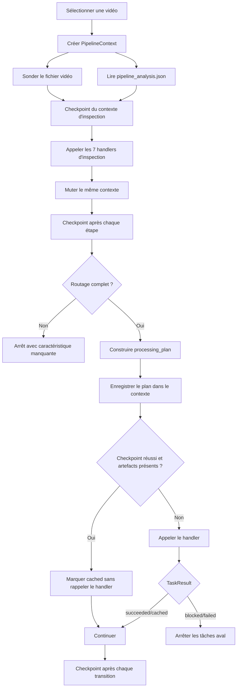

# RAG IONIS

Pipeline local de préparation de vidéos et interface RAG.

## Principe

Chaque vidéo est d'abord inspectée. Le pipeline produit ensuite
`metadata/video_manifest.json`, qui contient :

- les caractéristiques techniques réellement lues dans le fichier vidéo ;
- les résultats d'inspection visuelle et OCR ;
- les réponses aux règles de routage ;
- le pipeline sélectionné ;
- la liste et le handler Python de chaque étape ;
- les artefacts produits par chaque étape ;
- l'état d'exécution de chaque tâche.

Le code n'est plus séparé en dossiers `has_sub` et `no_sub`. Les utilitaires sont
uniques et le plan décide lesquels appeler.

## Architecture

```text
pipeline/
  __main__.py       # point d'entrée de python -m pipeline
  cli.py            # commandes inspect, plan, run et task
  discovery.py      # sélection all, nombre, ID ou chemin
  probe.py          # lecture durée, codecs, résolution, FPS et audio
  contracts.py      # RoutingFacts, PlannedTask, TaskResult et RunExecution
  context.py        # état mutable d'une vidéo et validation des artefacts
  options.py        # options communes validées
  planner.py        # règles de sélection des tâches
  catalog.py        # registre déclaratif des handlers
  step_handlers.py  # adaptateurs PipelineContext -> fonctions métier
  manifest.py       # génération et mise à jour du JSON
  executor.py       # exécution en mémoire et checkpoints
  orchestrator.py   # inspection, planification et traitement
  support/          # chemins, JSON atomique et helpers OpenAI Batch
  ingest/           # métadonnées YouTube et téléchargement
  publish/          # upload S3 et synchronisation PostgreSQL
  steps/
    inspection/     # frames, classification, interview, type et détection
    ocr/            # préparation, filtrage et revue des textes visuels
    transcripts/    # OCR, Whisper, corrections et enrichissement
    speakers/       # proposition, validation et diarisation
    chunks/         # chunks courts et hiérarchie des vidéos longues
    embeddings/     # embeddings des chunks

downloads/youtube/init/
  VIDEO_ID/
    VIDEO_ID.mp4
    metadata/
      video_manifest.json
      pipeline_analysis.json
    outputs/
      images/
      interview/
      ocr/
      speakers/
      transcripts_ocr/ ou transcripts_whisper/
      chunks/
```

### Pourquoi tout est dans `pipeline/`

Le package `pipeline` contient l'ensemble du cycle de traitement vidéo. Il n'y a
plus un orchestrateur d'un côté et des scripts indépendants de l'autre :

- la racine de `pipeline/` prend les décisions et pilote les exécutions ;
- `pipeline/steps/` contient les traitements métier appelés par les handlers ;
- `pipeline/support/` contient uniquement les fonctions internes partagées ;
- `pipeline/ingest/` prépare les entrées ;
- `pipeline/publish/` envoie les résultats vers S3 et PostgreSQL.

Une étape du registre peut être lancée seule, sans CLI dupliquée dans son module :

```powershell
.\.venv\Scripts\python.exe -m pipeline task frames.classify VIDEO_ID
```

Cette commande construit le même `PipelineContext` que l'orchestrateur, puis
appelle le handler dans le processus courant. La commande `task` constitue
l'unique interface de maintenance des étapes.

L'ingestion et la publication encadrent le traitement local, mais ne font pas
partie de `processing_plan()`. Elles restent des commandes explicites pour éviter
qu'un simple retraitement vidéo ne télécharge, n'upload ou ne modifie la base par
surprise.

### Responsabilité des modules

| Module | Responsabilité |
|---|---|
| `cli.py` | Parse les commandes, les options et le sélecteur de vidéos ; exécute aussi une tâche isolée du registre. |
| `discovery.py` | Trouve les vidéos et applique les sélecteurs `all`, nombre, ID ou chemin. |
| `probe.py` | Lit directement le fichier vidéo avec FFmpeg : durée, codecs, résolution, FPS, audio et rotation. |
| `contracts.py` | Définit les contrats typés `RoutingFacts`, `PlannedTask`, `TaskResult`, `TaskExecution` et `RunExecution`. |
| `context.py` | Définit le `PipelineContext` mutable : vidéo, options, faits de routage, plan, artefacts et exécutions. |
| `options.py` | Valide les options communes transmises aux étapes. |
| `catalog.py` | Associe chaque identifiant métier à un handler, une version et une éventuelle postcondition. |
| `step_handlers.py` | Adapte le contexte aux fonctions métier et retourne un `TaskResult` explicite. |
| `planner.py` | Produit la liste ordonnée des tâches selon les caractéristiques de la vidéo. |
| `manifest.py` | Valide, migre et sérialise le contexte dans le manifeste v4. |
| `executor.py` | Reprend les tâches valides, appelle les autres handlers et checkpoint chaque transition. |
| `orchestrator.py` | Coordonne les commandes publiques `inspect`, `plan` et `run` avec un seul contexte par vidéo. |
| `steps/` | Contient uniquement les algorithmes et sorties métier. |
| `support/` | Fournit les chemins, les écritures JSON atomiques et les primitives internes partagées. |

Les modules de `support/` ne doivent pas être ajoutés au catalogue : ils ne sont
pas des étapes autonomes.

La séparation interne suit trois règles :

- `catalog.py` sait quelle fonction appeler, mais ne décide pas quand l'appeler ;
- `planner.py` décide quelles tâches lancer et dans quel ordre, mais ne construit
  pas leurs paramètres ;
- une étape produit ses propres sorties, mais n'appelle jamais directement
  l'étape suivante.

Cette organisation combine **Pipeline Context**, **Pipeline Pattern**,
**Task Registry**, **Orchestrator** et **Checkpointing**. Un même objet mutable
traverse les étapes, tandis que quatre contrats rendent ses frontières
explicites :

- `RoutingFacts` valide les seuls faits persistants qui décident de la route ;
- `PlannedTask` conserve un plan typé jusqu'à la sérialisation ;
- `TaskResult` distingue `succeeded`, `cached`, `skipped`, `blocked` et `failed` ;
- `RunExecution` lie une exécution à un `run_id` et au hash exact de son plan.

Le manifeste v4 est la représentation persistée de ces contrats.

### Cycle de vie d'une vidéo

Le traitement standard exécuté par `python -m pipeline run VIDEO_ID` suit ce
flux :



En pratique :

1. `discovery.py` résout le sélecteur en chemin vidéo.
2. `PipelineContext.inspect()` appelle `probe_video()` et lit les observations déjà
   présentes dans `metadata/pipeline_analysis.json`.
3. L'inspection visuelle et OCR calcule `video_type` et `has_subtitles`.
4. Chaque handler retourne un `TaskResult` avec son statut et ses artefacts.
5. `processing_plan()` choisit la branche de transcript et le profil de chunks.
6. `catalog.py` résout chaque identifiant en fonction Python.
7. `executor.py` valide le plan entier et reprend les tâches dont la postcondition
   ou les artefacts sont encore valides.
8. Les autres fonctions sont appelées séquentiellement dans le même processus.
9. Le manifeste est checkpointé avant et après chaque tâche.

### Le `PipelineContext`

`PipelineContext` est l'objet de travail unique d'une vidéo. Il est mutable par
choix : les étapes enrichissent progressivement le même état au lieu de retourner
et retransmettre quinze paramètres.

Il contient notamment :

- `video_path`, les informations techniques sondées et les métadonnées YouTube ;
- `options`, c'est-à-dire les réglages effectifs du lancement ;
- `routing_facts`, instance immuable de `RoutingFacts` chargée depuis
  `metadata/pipeline_analysis.json` ;
- les propriétés dérivées `duration_seconds`, `is_long_video`,
  `transcript_strategy`, `chunk_strategy` et `video_type` ;
- `plan`, une liste ordonnée de `PlannedTask` ;
- `artifacts`, les chemins produits par tâche ;
- `execution`, un `RunExecution` associé au hash du plan courant ;
- `execution_history`, qui conserve les exécutions des plans précédents.

Une étape enregistrée dans le pipeline possède donc une signature simple :

```python
def normalize_brand(context: PipelineContext) -> TaskResult:
    result = process_video(
        context.video_path,
        force=context.force_rebuild,
    )
    if result is None:
        return TaskResult.blocked("Transcript source absent.")
    return TaskResult.succeeded(
        value=result,
        artifacts=[result],
    )
```

Les algorithmes métier restent dans `pipeline/steps/`. Les fonctions de
`step_handlers.py` sont de petits adaptateurs : elles extraient du contexte les
quelques options attendues par l'algorithme, appellent sa fonction par vidéo,
puis décrivent le résultat. L'exécuteur, qui connaît déjà l'identifiant de la
tâche, reste propriétaire de l'enregistrement des artefacts et du statut.

### Checkpoints

Le fichier `metadata/video_manifest.json` est réécrit atomiquement :

1. après la création du plan ;
2. juste avant chaque handler avec la tâche en `running` ;
3. juste après chaque handler avec ses artefacts et son statut ;
4. immédiatement en cas d'exception avec le message dans `error` ;
5. lors d'un blocage, avec les tâches aval en `skipped` ;
6. à la fin du pipeline avec le statut global `completed`.

Le JSON reste donc exploitable même si le processus est interrompu au milieu
d'une vidéo. Il décrit le dernier état cohérent connu du contexte. À la relance,
une tâche réussie n'est convertie en `cached` que si sa postcondition déclarée
est encore vraie ; sans postcondition, tous ses artefacts doivent exister, les
dossiers doivent être non vides et leur empreinte doit être inchangée. Une
invalidation rejoue aussi les tâches aval. La taille et la date de modification
de la vidéo participent au hash du plan. `--force` désactive toute reprise.

### Sources de vérité

Les informations sont volontairement réparties selon leur nature :

| Fichier ou dossier | Contenu | Gestion |
|---|---|---|
| `VIDEO_ID.mp4` | Source technique pour la durée, les codecs et la résolution. | Entrée, jamais modifiée. |
| `metadata/pipeline_analysis.json` | Uniquement les faits de routage : `video_type`, `has_subtitles` et ses détails. | Mis à jour par les étapes d'inspection concernées. |
| `metadata/video_manifest.json` | Plan, exécution courante, historique, artefacts, options et vues dérivées de la route. | Réécrit atomiquement par l'orchestrateur ; ne pas modifier manuellement. |
| `outputs/` | Frames, OCR, transcripts, speakers, chunks et embeddings. | Généré par les étapes métier. |

`RoutingFacts` est la source typée du routage. Le manifeste est la source de
vérité de l'exécution et des artefacts ; sa section `route` est calculée à partir
des faits et de la durée.

## Règles de routage

La durée est sondée directement dans la vidéo, sans dépendre des métadonnées
YouTube.

| Caractéristique | Décision |
|---|---|
| durée `> 600` secondes | chunks longs + résumés de sections + résumé global |
| durée `<= 600` secondes | chunks courts |
| sous-titres incrustés détectés | transcript OCR |
| pas de sous-titres incrustés | transcript WhisperX |
| interview, motion design ou captation | variante visuelle enregistrée dans la route |

Exemples de routes :

```text
short.ocr.motion_design
short.whisper.interview
long.ocr.video_recording
long.whisper.video_recording
```

Le seuil est strict : une vidéo de exactement 600 secondes reste courte.

La route possède trois dimensions :

```text
<chunk_strategy>.<transcript_strategy>.<visual_strategy>
```

- `chunk_strategy` vaut `short` ou `long` ;
- `transcript_strategy` vaut `ocr` ou `whisper` ;
- `visual_strategy` vaut actuellement `interview`, `motion_design` ou
  `video_recording`.

Le type visuel est conservé dans la route et peut être consommé par les étapes
métier. Il ne crée pas encore à lui seul une liste de tâches entièrement
différente dans `planner.py`. Par exemple, le cas `motion_design` est utilisé par
les utilitaires de transcript pour retomber sur les textes visibles lorsque la
transcription audio est vide.

## Plans d'exécution

### Inspection commune

L'inspection est identique pour toutes les vidéos et respecte cet ordre :

| Ordre | Identifiant | Module | Résultat principal |
|---:|---|---|---|
| 1 | `frames.extract` | `steps.inspection.extract_frames` | Frames échantillonnées dans `outputs/images/`. |
| 2 | `frames.classify` | `steps.inspection.classify_frames` | Classification footage, graphic ou mixture. |
| 3 | `video.detect_interview` | `steps.inspection.detect_interviews` | Indice d'interview dans `outputs/interview/`. |
| 4 | `video.infer_type` | `steps.inspection.infer_video_type` | `video_type` dans `pipeline_analysis.json`. |
| 5 | `ocr.extract_raw` | `steps.inspection.extract_raw_ocr` | OCR brut dans `outputs/ocr/`. |
| 6 | `ocr.extract_boxes` | `steps.inspection.extract_ocr_boxes` | Positions des zones de texte. |
| 7 | `video.detect_subtitles` | `steps.inspection.detect_subtitles` | `has_subtitles` et ses détails dans `pipeline_analysis.json`. |

La durée n'est pas une étape d'inspection : elle est obtenue immédiatement par
`probe.py` à partir du fichier vidéo.

### Traitements communs

Toutes les routes commencent par la préparation des textes visibles :

```text
ocr.build_processed
ocr.filter_overlays
ocr.extract_review_candidates
ocr.review_other_text
ocr.apply_review
```

Cette partie reste commune car l'OCR est utilisé aussi bien pour extraire des
sous-titres que pour enrichir ou corriger une transcription Whisper.

### Branche avec sous-titres OCR

Lorsque `has_subtitles=true`, le plan ajoute :

```text
transcript.extract_ocr
transcript.correct_ocr_spacing
transcript.normalize_brand
speakers.propose
speakers.validate
speakers.assign_ocr
transcript.create_plain
transcript.enrich
```

Le transcript principal est construit depuis les sous-titres incrustés. WhisperX
n'est pas lancé.

### Branche sans sous-titres

Lorsque `has_subtitles=false`, le plan ajoute :

```text
transcript.whisper
speakers.propose
speakers.validate
transcript.correct_whisper
transcript.enrich
transcript.create_plain
```

WhisperX produit le transcript audio et la diarisation. Les résultats OCR restent
utilisés pour corriger les noms propres et ajouter les textes visibles.

### Vidéos courtes et longues

Les deux branches de transcript se terminent par les tâches suivantes :

| Profil | Tâches finales |
|---|---|
| `short` | `chunks.create` avec le profil court, puis `embeddings.create`. |
| `long` | `chunks.create` avec le profil long, `chunks.summarize_sections`, `chunks.summarize_video`, puis `embeddings.create`. |

Le profil long produit trois niveaux de chunks :

```text
global
└── section
    └── detail
```

Les relations logiques entre ces niveaux sont ensuite converties en
`chunk_parent_id` pendant la synchronisation PostgreSQL.

### Matrice synthétique

| Durée | Sous-titres | Transcript | Chunks | Route type |
|---|---|---|---|---|
| `<= 600 s` | oui | OCR | détails uniquement | `short.ocr.<type>` |
| `<= 600 s` | non | WhisperX | détails uniquement | `short.whisper.<type>` |
| `> 600 s` | oui | OCR | détails + sections + global | `long.ocr.<type>` |
| `> 600 s` | non | WhisperX | détails + sections + global | `long.whisper.<type>` |

## Manifeste JSON

Extrait simplifié :

```json
{
  "schema_version": 4,
  "video": {
    "id": "LJ-W6BjSJRo",
    "duration_seconds": 742.4,
    "has_audio": true
  },
  "routing_facts": {
    "has_subtitles": false,
    "video_type": "interview",
    "has_subtitles_details": {
      "score": 0.08
    }
  },
  "route": {
    "status": "ready",
    "pipeline_id": "long.whisper.interview",
    "transcript_strategy": "whisper",
    "chunk_strategy": "long",
    "visual_strategy": "interview"
  },
  "artifacts": {
    "by_task": {
      "transcript.whisper": [
        "outputs/transcripts_whisper/whisper_transcript_timecoded.txt"
      ]
    }
  },
  "plan": {
    "hash": "PLAN_HASH",
    "task_count": 1,
    "tasks": [
      {
        "id": "transcript.whisper",
        "reason": "has_subtitles=false",
        "handler": "pipeline.step_handlers.transcribe_whisper",
        "version": "1"
      }
    ]
  },
  "execution": {
    "run_id": "9f5bdba8df624b93a12296a809bc44d0",
    "plan_hash": "PLAN_HASH",
    "status": "completed",
    "tasks": {
      "transcript.whisper": {
        "status": "completed",
        "started_at": "2026-07-16T19:00:00+00:00",
        "finished_at": "2026-07-16T19:08:00+00:00",
        "attempts": 1
      }
    }
  },
  "execution_history": []
}
```

### Structure du manifeste

Les sections principales ont chacune un rôle précis :

| Section | Description |
|---|---|
| `video` | Informations techniques retournées par `probe.py`. |
| `routing_facts` | Source typée du routage : sous-titres, type de vidéo et détails de détection. |
| `route` | Route dérivée, stratégies choisies et caractéristiques manquantes. |
| `options` | Options effectives utilisées pour générer le plan. |
| `artifacts` | Fichiers produits, regroupés par identifiant de tâche. |
| `plan` | Hash reproductible et liste ordonnée des tâches avec raison, handler et version. |
| `execution` | `run_id`, `plan_hash`, état global et état horodaté des tâches du plan courant. |
| `execution_history` | Exécutions archivées lorsque le hash du plan change. |

Avant la fin de l'inspection, une réponse peut valoir `null` et le routage peut
ressembler à ceci :

```json
{
  "route": {
    "status": "needs_content_inspection",
    "pipeline_id": "short",
    "transcript_strategy": null,
    "chunk_strategy": "short",
    "visual_strategy": null,
    "missing_facts": [
      "has_subtitles",
      "video_type"
    ]
  }
}
```

Après chaque lancement réel, `execution.status` vaut l'un des états suivants :

| État | Signification |
|---|---|
| `not_started` | Le plan a été généré mais n'a pas encore été exécuté. |
| `running` | Une exécution est en cours. |
| `completed` | Toutes les tâches du lancement sont terminées. |
| `blocked` | Une tâche n'a pas satisfait son contrat ; les tâches aval ont été ignorées. |
| `failed` | Une tâche a échoué et l'exécution s'est arrêtée. |

Une tâche possède les états `not_started`, `running`, `completed`, `cached`,
`skipped`, `blocked` ou `failed`. `completed` est la représentation JSON
compatible du statut Python `TaskStatus.SUCCEEDED`. Chaque entrée peut contenir
`started_at`, `finished_at`, `reason`, `error`, `attempts` et
`artifact_fingerprint`. Les dates sont enregistrées en UTC.

`plan.hash` et `execution.plan_hash` doivent toujours être identiques. Quand
l'inspection terminée est remplacée par le plan de traitement :

- l'exécution des sept tâches d'inspection est déplacée dans
  `execution_history` ;
- une nouvelle exécution, avec un nouveau `run_id`, est créée pour le plan de
  traitement.

Si un plan déjà connu redevient courant, son `RunExecution` est restauré depuis
`execution_history`. Ses checkpoints ne sont repris que si leurs empreintes
d'artefacts correspondent encore ; un fichier écrasé entre-temps est donc
reconstruit.

Le lecteur accepte les manifestes v3 pour migration. Toute corruption JSON,
version inconnue ou incohérence entre les hash du plan et de l'exécution produit
une erreur explicite au lieu de remplacer silencieusement l'état.

## Installation

Le projet utilise un environnement Python unique :

```powershell
py -3.10 -m venv .venv
.\.venv\Scripts\python.exe -m pip install --upgrade pip setuptools wheel
.\.venv\Scripts\python.exe -m pip install -r requirements.txt
Copy-Item .env.example .env
```

Variables principales :

```text
YOUTUBE_API_KEY=...
OPENAI_API_KEY=...
HUGGINGFACE_TOKEN=...

WHISPERX_MODEL=large-v3
WHISPERX_LANGUAGE=fr
WHISPERX_DEVICE=cuda
WHISPERX_COMPUTE_TYPE=float16
WHISPERX_BATCH_SIZE=16

S3_BUCKET_NAME=...
S3_REGION=...
S3_ACCESS_KEY_ID=...
S3_SECRET_ACCESS_KEY=...
```

## Utilisation du pipeline

### Comportement des commandes

| Commande | Effet |
|---|---|
| `inspect --probe-only` | Sonde seulement le fichier et écrit un manifeste contenant le plan d'inspection. Aucun traitement visuel ou OCR n'est lancé. |
| `inspect` | Sonde la vidéo, exécute les sept tâches d'inspection, recharge le contexte puis écrit le plan de traitement sélectionné. |
| `plan` | N'exécute aucune tâche. Si le routage est complet, écrit le plan de traitement ; sinon écrit le plan d'inspection. |
| `plan --include-inspection` | Force l'écriture du plan d'inspection même si les caractéristiques sont déjà connues. |
| `run` | Exécute l'inspection, recalcule la route, puis exécute le plan de traitement. |
| `run --skip-inspection` | Réutilise `pipeline_analysis.json` si le routage est complet. Si une caractéristique manque, l'inspection est quand même exécutée. |
| `task --list` | Affiche les identifiants, phases et titres du registre. |
| `task TASK_ID [SELECTOR]` | Exécute une seule tâche enregistrée avec le contexte, les options et les checkpoints habituels. |

Les commandes `plan` et `--dry-run` ne modifient pas les sorties métier.
`plan` écrit néanmoins le manifeste, puisque celui-ci constitue le résultat de la
planification.

Sonder uniquement les informations techniques et écrire le JSON :

```powershell
.\.venv\Scripts\python.exe -m pipeline inspect 1 --probe-only
```

Inspecter le contenu d'une vidéo puis générer sa route :

```powershell
.\.venv\Scripts\python.exe -m pipeline inspect VIDEO_ID
```

Générer ou régénérer le plan sans exécuter les traitements :

```powershell
.\.venv\Scripts\python.exe -m pipeline plan VIDEO_ID
.\.venv\Scripts\python.exe -m pipeline plan VIDEO_ID --include-inspection
```

Exécuter l'inspection puis le pipeline sélectionné :

```powershell
.\.venv\Scripts\python.exe -m pipeline run VIDEO_ID
```

Lister le registre ou exécuter une étape isolée :

```powershell
.\.venv\Scripts\python.exe -m pipeline task --list
.\.venv\Scripts\python.exe -m pipeline task frames.classify VIDEO_ID
.\.venv\Scripts\python.exe -m pipeline task transcript.enrich VIDEO_ID --force
```

Un identifiant absent du registre est rejeté avant le démarrage de l'exécution.

Sélecteurs acceptés :

```powershell
.\.venv\Scripts\python.exe -m pipeline run 3
.\.venv\Scripts\python.exe -m pipeline run all
.\.venv\Scripts\python.exe -m pipeline run downloads/youtube/init/VIDEO_ID
.\.venv\Scripts\python.exe -m pipeline run downloads/youtube/init/VIDEO_ID/VIDEO_ID.mp4
```

Options utiles :

```powershell
.\.venv\Scripts\python.exe -m pipeline run VIDEO_ID --dry-run
.\.venv\Scripts\python.exe -m pipeline run VIDEO_ID --force
.\.venv\Scripts\python.exe -m pipeline run VIDEO_ID --skip-inspection
.\.venv\Scripts\python.exe -m pipeline run VIDEO_ID --openai-mode batch
.\.venv\Scripts\python.exe -m pipeline run VIDEO_ID --review-scope all
.\.venv\Scripts\python.exe -m pipeline run VIDEO_ID --correction-mode conservative
```

Par défaut, la racine vidéo est `downloads/youtube/init`. Elle peut être changée
avec `--root`.

### Sélecteurs

Le sélecteur positionnel accepte :

| Valeur | Sélection |
|---|---|
| `all` | Toutes les vidéos valides trouvées sous `--root`. |
| nombre positif | Les N premières vidéos, triées par chemin. |
| `VIDEO_ID` | La vidéo dont le fichier ou le dossier porte cet identifiant. |
| chemin de dossier | L'unique vidéo présente directement dans ce dossier. |
| chemin de fichier | Ce fichier vidéo précis. |

Un dossier vidéo doit contenir exactement un fichier `.mp4`, `.mkv`, `.webm`,
`.mov` ou `.m4v` directement à sa racine.

### Options communes

| Option | Effet |
|---|---|
| `--force` | Désactive la reprise par checkpoint et demande aux handlers de régénérer leurs sorties. |
| `--dry-run` | Affiche les handlers sélectionnés sans les exécuter. |
| `--openai-mode normal|batch` | Choisit le mode global des appels OpenAI compatibles. |
| `--review-scope duo|all` | En mode `duo`, limite la revue des textes visuels à une image par vidéo. |
| `--image-review-model` | Remplace le modèle de revue des textes visuels. |
| `--speaker-validation-model` | Remplace le modèle utilisé pour valider les speakers et corriger les espaces OCR. |
| `--correction-mode` | Règle le niveau de correction Whisper : `conservative`, `balanced` ou `aggressive`. |
| `--frame-interval` | Intervalle en secondes entre les frames extraites. |
| `--details-per-section` | Nombre de chunks détail regroupés dans une section pour les vidéos longues. |

Pour afficher le plan de traitement en dry-run, il faut disposer d'un
`pipeline_analysis.json` complet :

```powershell
.\.venv\Scripts\python.exe -m pipeline run VIDEO_ID --skip-inspection --dry-run
```

Sans `--skip-inspection`, `run --dry-run` affiche uniquement les handlers
d'inspection et s'arrête avant de simuler le plan aval, puisque les nouvelles
caractéristiques n'ont pas réellement été calculées.

### Erreurs et reprise

Avant de démarrer, l'exécuteur valide tous les identifiants et l'absence de
doublons dans le plan. Il s'arrête ensuite à la première exception ou au premier
`TaskResult.blocked` :

1. le statut global passe à `failed` ;
2. la tâche concernée passe à `failed` ;
3. le message de l'exception est enregistré dans `execution.tasks.<id>.error` ;
4. les tâches suivantes ne sont pas exécutées.

Pour un blocage métier, le statut global et la tâche deviennent `blocked`, la
raison est persistée et les tâches aval deviennent `skipped`.

Lors d'une relance avec le même plan, les mêmes options et les mêmes faits de
routage, le `plan_hash` reste stable. Les tâches déjà réussies dont les artefacts
existent encore sont reprises en `cached`, puis l'exécution repart exactement à
la première tâche incomplète ou invalide :

```powershell
.\.venv\Scripts\python.exe -m pipeline run VIDEO_ID --skip-inspection
```

Si un fichier enregistré a disparu, sa tâche est réexécutée automatiquement.
Utiliser `--force` uniquement lorsqu'il faut reconstruire toutes les sorties :

```powershell
.\.venv\Scripts\python.exe -m pipeline run VIDEO_ID --skip-inspection --force
```

## Maintenir et étendre le pipeline

### Ajouter une nouvelle étape métier

Une étape doit rester autonome au niveau Python et être exécutable par la commande
générique `pipeline task`.

1. Créer le module dans le domaine approprié :

   ```text
   pipeline/steps/ocr/
   pipeline/steps/transcripts/
   pipeline/steps/speakers/
   pipeline/steps/chunks/
   pipeline/steps/embeddings/
   ```

2. Exposer une fonction Python par vidéo, par exemple
   `clean_transcript(video_path, force=False)`. Ne pas ajouter de nouveau
   `argparse`, `main()`, sélecteur de vidéos ou recherche du dernier dossier dans
   le module métier.

3. Écrire les sorties sous `metadata/` ou `outputs/`, en utilisant
   `pipeline.support.paths` pour conserver une arborescence homogène.

4. Ajouter dans `pipeline/step_handlers.py` un adaptateur qui reçoit uniquement
   le contexte et retourne un contrat explicite :

   ```python
   def clean_transcript(context: PipelineContext) -> TaskResult:
       result = clean_video(
           context.video_path,
           force=context.force_rebuild,
       )
       if result is None:
           return TaskResult.blocked("Transcript source absent.")
       return TaskResult.succeeded(value=result, artifacts=[result])
   ```

5. Ajouter la `TaskSpec` dans `_TASK_SPECS` dans `pipeline/catalog.py` ; le
   dictionnaire `TASKS` est dérivé automatiquement :

   ```python
   TaskSpec(
       "transcript.clean",
       "processing",
       "Nettoyer le transcript",
       step_handlers.clean_transcript,
       version="1",
       postcondition=lambda context: transcript_path(context.video_path).exists(),
   )
   ```

   Incrémenter `version` lorsque le sens ou le format des sorties change : cette
   valeur participe au `plan_hash` et invalide ainsi une reprise devenue obsolète.

6. Ajouter l'identifiant dans la bonne séquence de `pipeline/planner.py`, ou
   l'insérer selon une nouvelle condition.

7. Ajouter un test vérifiant au minimum :

   - que la bonne route contient la tâche ;
   - que les autres routes ne la contiennent pas si elle est conditionnelle ;
   - que le handler sérialisé dans le manifeste pointe vers la bonne fonction ;
   - que l'exécuteur transmet bien le même `PipelineContext`.

8. Vérifier son point d'entrée commun :

   ```powershell
   .\.venv\Scripts\python.exe -m pipeline task transcript.clean VIDEO_ID --dry-run
   ```

Une étape ne doit pas appeler directement l'étape suivante. L'ordre appartient à
`planner.py` et l'exécution appartient à `executor.py`.

### Ajouter une règle de routage

Pour ajouter une caractéristique qui influence le pipeline :

1. produire ou lire sa valeur dans une étape d'inspection ;
2. la stocker dans `metadata/pipeline_analysis.json` ;
3. l'ajouter à `RoutingFacts` avec sa validation et sa sérialisation ;
4. l'exposer comme propriété dérivée dans `PipelineContext` et dans `route` ;
5. modifier `processing_plan()` pour sélectionner les tâches concernées ;
6. ajouter les scénarios limites dans `tests/test_pipeline_routing.py`.

Une valeur nécessaire au routage doit être signalée dans
`route.missing_facts` lorsqu'elle est absente. Cela empêche le traitement de
partir silencieusement dans une branche par défaut.

### Ajouter un helper partagé

Un helper sans CLI va dans `pipeline/support/`. Il peut être importé par plusieurs
étapes, mais ne doit pas être enregistré dans `TASKS`.

Exemples :

- `support/json_io.py` pour les lectures contrôlées et écritures atomiques ;
- `support/openai_batch.py` pour l'état, le polling et la lecture JSONL des batches ;
- résolution des chemins de sorties ;
- lecture et mise à jour des seuls `RoutingFacts` ;
- primitives PaddleOCR ;
- filtrage géométrique ou textuel partagé.

Un nouveau traitement OpenAI Batch doit réutiliser `support/openai_batch.py` au
lieu de redéfinir ses statuts terminaux, sa boucle de polling ou son format
d'état.

### Modifier une option globale

Une option qui doit apparaître dans le manifeste et être disponible pour
plusieurs tâches doit être ajoutée aux quatre endroits suivants :

1. `PipelineOptions` dans `options.py` ;
2. la CLI dans `cli.py` ;
3. `options_from_args()` ;
4. les handlers concernés via `context.options`.

Les valeurs de `PipelineOptions` sont sérialisées dans `manifest.options`, ce qui
permet de reproduire le plan généré.

## Ingestion

Charger les métadonnées YouTube dans PostgreSQL :

```powershell
.\.venv\Scripts\python.exe -m pipeline.ingest.fetch_youtube_metadata
```

Télécharger ou compléter les vidéos locales :

```powershell
.\.venv\Scripts\python.exe -m pipeline.ingest.download_videos
```

Chaque dossier vidéo doit contenir exactement un fichier vidéo à sa racine. Les
autres fichiers sont générés dans `metadata/` et `outputs/`.

## Publication

Uploader les vidéos et leurs sorties :

```powershell
.\.venv\Scripts\python.exe -m pipeline.publish.upload_outputs_to_s3
.\.venv\Scripts\python.exe -m pipeline.publish.upload_outputs_to_s3 --dry-run
```

Synchroniser les métadonnées, transcripts et chunks dans PostgreSQL :

```powershell
.\.venv\Scripts\python.exe -m pipeline.publish.sync_database
.\.venv\Scripts\python.exe -m pipeline.publish.sync_database --dry-run
```

Les chunks longs sont stockés avec les niveaux `detail`, `section` et `global`.
Les embeddings utilisent `text-embedding-3-large` en 2000 dimensions.

## Base de données

Démarrer PostgreSQL et Phoenix :

```powershell
docker compose up -d postgres phoenix
```

Vider les tables applicatives en conservant le schéma :

```powershell
.\.venv\Scripts\python.exe utils/clear_database.py
```

Recréer le schéma complet :

```powershell
.\.venv\Scripts\python.exe utils/reset_database.py
```

Le schéma source est `docker/postgres/init/001_schema.sql`.

## Interface RAG

Démarrer l'API et l'interface :

```powershell
.\.venv\Scripts\python.exe -m uvicorn interface.app:app --host 127.0.0.1 --port 8000
```

- interface : `http://127.0.0.1:8000/`
- santé API : `http://127.0.0.1:8000/health`
- Phoenix : `http://127.0.0.1:6006/`

Le backend combine recherche SQL, BM25, recherche vectorielle pgvector, fusion RRF
et reranking. Les traces OpenTelemetry sont envoyées à Phoenix lorsque
`PHOENIX_ENABLED=true`.

## Tests

```powershell
.\.venv\Scripts\python.exe -m unittest discover -s tests -p "test*.py"
```
