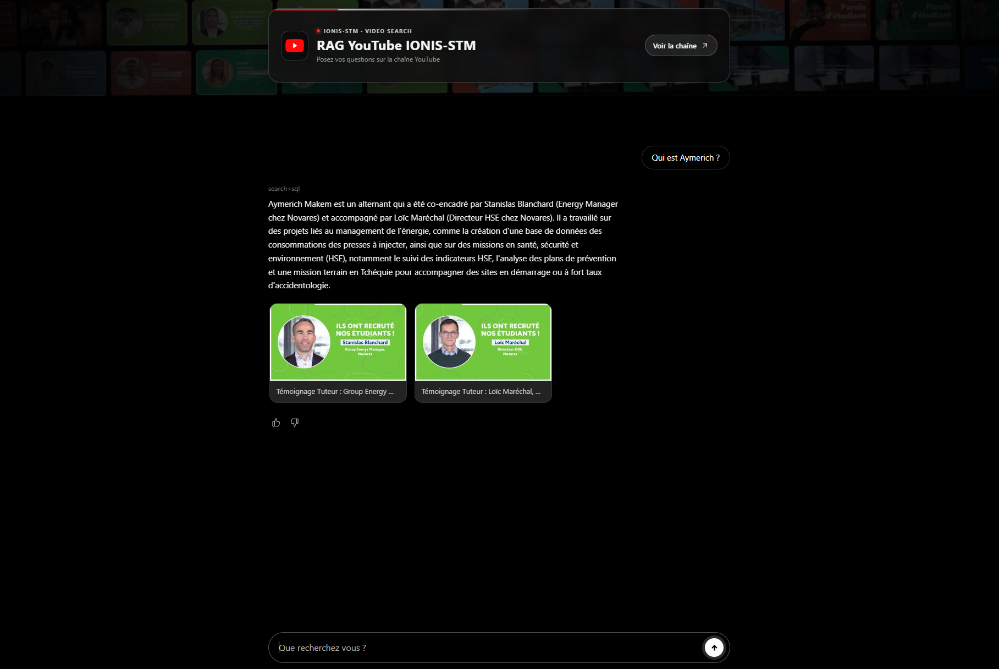
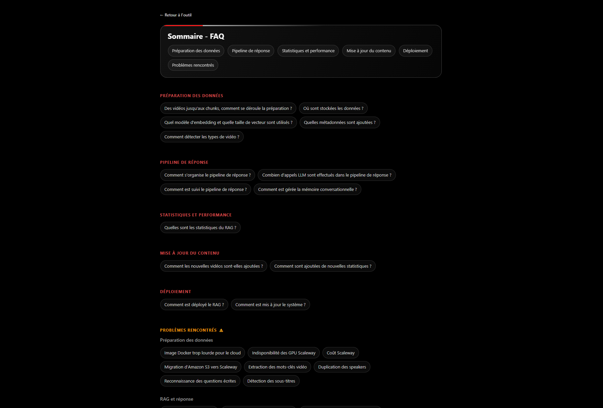
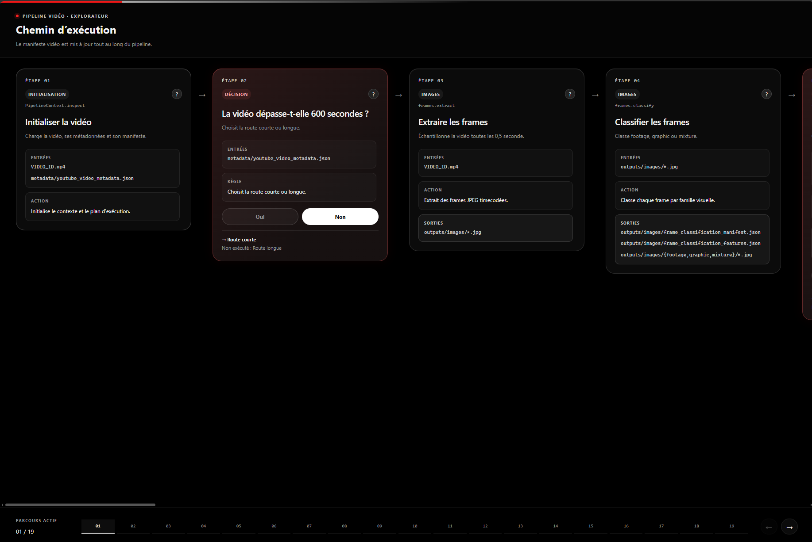
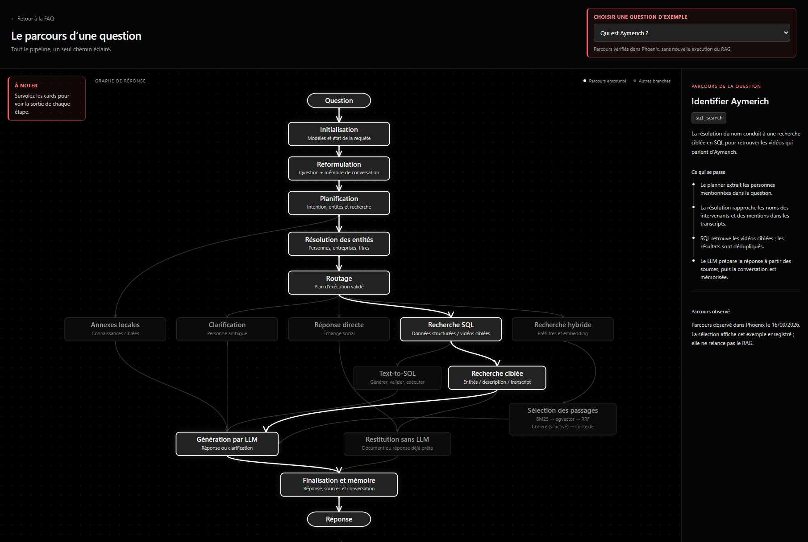

# RAG YouTube IONIS-STM

Ce projet transforme les vidéos de la chaîne YouTube IONIS-STM en une base interrogeable : un pipeline prépare les vidéos, leurs transcriptions, leurs métadonnées et leurs embeddings, puis un RAG répond aux questions en s'appuyant sur les contenus retrouvés. L'application est disponible sur [ionis.tanguym.fr](https://ionis.tanguym.fr) ; son fonctionnement, son architecture, ses performances et son déploiement sont détaillés dans la [FAQ](https://ionis.tanguym.fr/faq). Explorez aussi le [pipeline de préparation des vidéos](https://ionis.tanguym.fr/pipeline_preparation_videos/) et le [pipeline de réponse](https://ionis.tanguym.fr/pipeline_reponse/).

## Aperçu

### Application

### FAQ

### Pipeline de préparation des vidéos

### Pipeline de réponse

