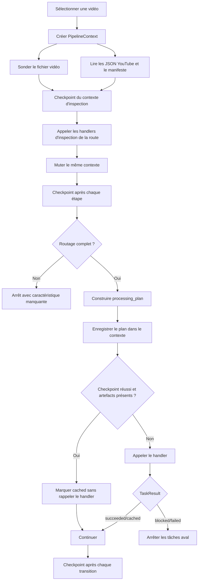

# RAG IONIS

Pipeline local de préparation de vidéos et interface RAG.

## Déploiement

Le développement Windows reste piloté par `start_app.bat`. En production,
l'interface RAG est déployée avec Docker sur un VPS Infomaniak, tandis qu'Amazon
S3 conserve les artefacts. Voir
[`README_HEBERGEMENT_DEBUTANT.md`](README_HEBERGEMENT_DEBUTANT.md).

## Principe

Chaque vidéo est d'abord inspectée. Le pipeline produit ensuite
`metadata/video_manifest.json`, qui contient :

- les caractéristiques techniques réellement lues dans le fichier vidéo ;
- les résultats d'inspection visuelle et OCR ;
- les réponses aux règles de routage ;
- le pipeline sélectionné ;
- la liste et le handler Python de chaque étape ;
- les artefacts produits par chaque étape ;
- l'état d'exécution de chaque tâche.

Le code n'est plus séparé en dossiers `has_sub` et `no_sub`. Les utilitaires sont
uniques et le plan décide lesquels appeler.

## Architecture

```text
pipeline/
  __main__.py       # point d'entrée de python -m pipeline
  cli.py            # commandes inspect, plan, run et task
  discovery.py      # sélection all, nombre, ID ou chemin
  probe.py          # lecture codecs, résolution, FPS et audio
  contracts.py      # RoutingFacts, PlannedTask, TaskResult et RunExecution
  context.py        # état mutable d'une vidéo et validation des artefacts
  options.py        # options communes validées
  planner.py        # règles de sélection des tâches
  catalog.py        # registre déclaratif des handlers
  step_handlers.py  # adaptateurs PipelineContext -> fonctions métier
  manifest.py       # génération et mise à jour du JSON
  executor.py       # exécution en mémoire et checkpoints
  orchestrator.py   # inspection, planification et traitement
  support/          # chemins, JSON atomique et helpers OpenAI Batch
  ingest/           # métadonnées YouTube et téléchargement
  publish/          # upload S3 et synchronisation PostgreSQL
  steps/
    inspection/     # frames, classification, interview, type et détection
    ocr/            # préparation, filtrage et revue des textes visuels
    transcripts/    # OCR, Whisper, corrections et enrichissement
    speakers/       # proposition, validation et diarisation
    chunks/         # chunks courts et hiérarchie des vidéos longues
    embeddings/     # embeddings des chunks

downloads/youtube/init/
  VIDEO_ID/
    VIDEO_ID.mp4
    metadata/
      youtube_video_metadata.json
      video_manifest.json
    outputs/
      images/
      interview/
      ocr/
      speakers/
      transcripts_whisper/ # transcript canonique WhisperX
      transcripts_ocr/     # contient seulement plain_transcript.txt
      chunks/
```

### Pourquoi tout est dans `pipeline/`

Le package `pipeline` contient l'ensemble du cycle de traitement vidéo. Il n'y a
plus un orchestrateur d'un côté et des scripts indépendants de l'autre :

- la racine de `pipeline/` prend les décisions et pilote les exécutions ;
- `pipeline/steps/` contient les traitements métier appelés par les handlers ;
- `pipeline/support/` contient uniquement les fonctions internes partagées ;
- `pipeline/ingest/` prépare les entrées ;
- `pipeline/publish/` envoie les résultats vers S3 et PostgreSQL.

Une étape du registre peut être lancée seule, sans CLI dupliquée dans son module :

```powershell
.\.venv\Scripts\python.exe -m pipeline task frames.classify VIDEO_ID
```

Cette commande construit le même `PipelineContext` que l'orchestrateur, puis
appelle le handler dans le processus courant. La commande `task` constitue
l'unique interface de maintenance des étapes.

L'ingestion et la publication encadrent le traitement local, mais ne font pas
partie de `processing_plan()`. Elles restent des commandes explicites pour éviter
qu'un simple retraitement vidéo ne télécharge, n'upload ou ne modifie la base par
surprise.

### Responsabilité des modules

| Module | Responsabilité |
|---|---|
| `cli.py` | Parse les commandes, les options et le sélecteur de vidéos ; exécute aussi une tâche isolée du registre. |
| `discovery.py` | Trouve les vidéos et applique les sélecteurs `all`, nombre, ID ou chemin. |
| `probe.py` | Lit directement le fichier vidéo avec FFmpeg : codecs, résolution, FPS, audio et rotation. |
| `contracts.py` | Définit les contrats typés `RoutingFacts`, `PlannedTask`, `TaskResult`, `TaskExecution` et `RunExecution`. |
| `context.py` | Définit le `PipelineContext` mutable : vidéo, options, faits de routage, plan, artefacts et exécutions. |
| `options.py` | Valide les options communes transmises aux étapes. |
| `catalog.py` | Associe chaque identifiant métier à un handler, une version et une éventuelle postcondition. |
| `step_handlers.py` | Adapte le contexte aux fonctions métier et retourne un `TaskResult` explicite. |
| `planner.py` | Produit la liste ordonnée des tâches selon les caractéristiques de la vidéo. |
| `manifest.py` | Valide, migre et sérialise le contexte dans le manifeste v4. |
| `executor.py` | Reprend les tâches valides, appelle les autres handlers et checkpoint chaque transition. |
| `orchestrator.py` | Coordonne les commandes publiques `inspect`, `plan` et `run` avec un seul contexte par vidéo. |
| `steps/` | Contient uniquement les algorithmes et sorties métier. |
| `support/` | Fournit les chemins, les écritures JSON atomiques et les primitives internes partagées. |

Les modules de `support/` ne doivent pas être ajoutés au catalogue : ils ne sont
pas des étapes autonomes.

La séparation interne suit trois règles :

- `catalog.py` sait quelle fonction appeler, mais ne décide pas quand l'appeler ;
- `planner.py` décide quelles tâches lancer et dans quel ordre, mais ne construit
  pas leurs paramètres ;
- une étape produit ses propres sorties, mais n'appelle jamais directement
  l'étape suivante.

Cette organisation combine **Pipeline Context**, **Pipeline Pattern**,
**Task Registry**, **Orchestrator** et **Checkpointing**. Un même objet mutable
traverse les étapes, tandis que quatre contrats rendent ses frontières
explicites :

- `RoutingFacts` valide les seuls faits persistants qui décident de la route ;
- `PlannedTask` conserve un plan typé jusqu'à la sérialisation ;
- `TaskResult` distingue `succeeded`, `cached`, `skipped`, `blocked` et `failed` ;
- `RunExecution` lie une exécution à un `run_id` et au hash exact de son plan.

Le manifeste v4 est la représentation persistée de ces contrats.

### Cycle de vie d'une vidéo

Le traitement standard exécuté par `python -m pipeline run VIDEO_ID` suit ce
flux :



En pratique :

1. `discovery.py` résout le sélecteur en chemin vidéo.
2. `PipelineContext.inspect()` lit obligatoirement `duration_seconds` dans
   `metadata/youtube_video_metadata.json`, appelle `probe_video()` pour les
   caractéristiques du conteneur, puis recharge les faits de routage déjà
   présents dans `metadata/video_manifest.json`.
3. Pour les vidéos courtes, l'inspection visuelle et OCR calcule `video_type`
   et `has_subtitles`. Pour `long_video`, la durée suffit et aucune image ni
   étape OCR n'est produite.
4. Chaque handler retourne un `TaskResult` avec son statut et ses artefacts.
5. `processing_plan()` utilise la chaîne complète pour les vidéos courtes. Pour
   `long_video`, il conserve uniquement WhisperX brut, le plain transcript et
   les chunks hiérarchiques.
6. `catalog.py` résout chaque identifiant en fonction Python.
7. `executor.py` valide le plan entier et reprend les tâches dont la postcondition
   ou les artefacts sont encore valides.
8. Les autres fonctions sont appelées séquentiellement dans le même processus.
9. Le manifeste est checkpointé avant et après chaque tâche.

### Le `PipelineContext`

`PipelineContext` est l'objet de travail unique d'une vidéo. Il est mutable par
choix : les étapes enrichissent progressivement le même état au lieu de retourner
et retransmettre quinze paramètres.

Il contient notamment :

- `video_path`, les informations techniques sondées et les métadonnées YouTube,
  dont la durée de référence ;
- `options`, c'est-à-dire les réglages effectifs du lancement ;
- `routing_facts`, instance immuable de `RoutingFacts` chargée depuis la section
  correspondante de `metadata/video_manifest.json` ;
- les propriétés dérivées `duration_seconds`, `is_long_video`,
  `transcript_strategy`, `chunk_strategy` et `video_type` ;
- `plan`, une liste ordonnée de `PlannedTask` ;
- `artifacts`, les chemins produits par tâche ;
- `execution`, un `RunExecution` associé au hash du plan courant ;
- `execution_history`, qui conserve les exécutions des plans précédents.

Une étape enregistrée dans le pipeline possède donc une signature simple :

```python
def normalize_brand(context: PipelineContext) -> TaskResult:
    result = process_video(
        context.video_path,
        force=context.force_rebuild,
    )
    if result is None:
        return TaskResult.blocked("Transcript source absent.")
    return TaskResult.succeeded(
        value=result,
        artifacts=[result],
    )
```

Les algorithmes métier restent dans `pipeline/steps/`. Les fonctions de
`step_handlers.py` sont de petits adaptateurs : elles extraient du contexte les
quelques options attendues par l'algorithme, appellent sa fonction par vidéo,
puis décrivent le résultat. L'exécuteur, qui connaît déjà l'identifiant de la
tâche, reste propriétaire de l'enregistrement des artefacts et du statut.

### Checkpoints

Le fichier `metadata/video_manifest.json` est réécrit atomiquement :

1. après la création du plan ;
2. juste avant chaque handler avec la tâche en `running` ;
3. juste après chaque handler avec ses artefacts et son statut ;
4. immédiatement en cas d'exception avec le message dans `error` ;
5. lors d'un blocage, avec les tâches aval en `skipped` ;
6. à la fin du pipeline avec le statut global `completed`.

Le JSON reste donc exploitable même si le processus est interrompu au milieu
d'une vidéo. Il décrit le dernier état cohérent connu du contexte. À la relance,
une tâche réussie n'est convertie en `cached` que si sa postcondition déclarée
est encore vraie ; sans postcondition, tous ses artefacts doivent exister, les
dossiers doivent être non vides et leur empreinte doit être inchangée. Une
invalidation rejoue aussi les tâches aval. La taille et la date de modification
de la vidéo participent au hash du plan. `pipeline run --force` supprime d'abord
entièrement `outputs/`, puis reconstruit la chaîne principale sans reprise,
jusqu'aux chunks. Les embeddings doivent ensuite être recréés avec leur tâche
dédiée. En revanche, `pipeline task ... --force` ne force que la tâche demandée.

### Sources de vérité

Les informations sont volontairement réparties selon leur nature :

| Fichier ou dossier | Contenu | Gestion |
|---|---|---|
| `VIDEO_ID.mp4` | Source technique pour les codecs, le FPS, l'audio et la résolution. | Entrée, jamais modifiée. |
| `metadata/youtube_video_metadata.json` | Métadonnées de l'API YouTube, notamment la durée de référence `duration_seconds`. | Produit par l'ingestion ; obligatoire pour inspecter et router la vidéo. |
| `metadata/youtube_comments.json` | Commentaires YouTube et réponses, avec leur relation parent-enfant. | Produit par l'ingestion puis importé en SQL par `sync_database`. |

`pipeline.ingest.fetch_youtube_metadata` recrée le cache central et écrase
également ce fichier dans chaque dossier vidéo local correspondant. Cette
commande ne retélécharge pas les vidéos. Par défaut, elle synchronise aussi
le cache central `init/_00_info_comments/` et copie tous les commentaires et leurs
réponses dans `metadata/youtube_comments.json` pour les vidéos déjà locales.
Elle ne se connecte jamais à PostgreSQL. `--skip-comments` désactive cette
récupération.
| `metadata/video_manifest.json` | Faits de routage, plan, exécution courante, historique, artefacts, options et route dérivée. | Source de vérité unique, réécrite atomiquement par l'orchestrateur ; ne pas modifier manuellement. |
| `outputs/` | Frames, OCR, transcripts, speakers, chunks et embeddings. | Généré par les étapes métier. |

`RoutingFacts` est le contrat typé du routage. Sa représentation persistée se
trouve dans `video_manifest.json.routing_facts` ; la section `route` est calculée
à partir de ces faits et de la durée.

## Règles de routage

La durée de référence est lue exclusivement dans
`metadata/youtube_video_metadata.json`, produit par l'API YouTube. FFmpeg reste
utilisé uniquement pour les autres caractéristiques du fichier.

| Caractéristique | Décision |
|---|---|
| durée `> 600` secondes | chunks longs + résumés de sections + résumé global |
| durée `<= 600` secondes | chunks courts |
| toutes les vidéos | transcript canonique WhisperX |
| sous-titres incrustés détectés | plain transcript OCR de correction |
| pas de sous-titres incrustés | aucune référence OCR de sous-titres |
| interview, motion design, captation ou vidéo longue | variante enregistrée dans la route |

Exemples de routes :

```text
short.whisper.interview
short.whisper.motion_design
long.whisper.long_video
```

Le seuil est strict : une vidéo de exactement 600 secondes reste courte.

La route possède trois dimensions :

```text
<chunk_strategy>.<transcript_strategy>.<visual_strategy>
```

- `chunk_strategy` vaut `short` ou `long` ;
- `transcript_strategy` vaut toujours `whisper` : il désigne la source
  canonique, pas la présence éventuelle d'une référence OCR de correction ;
- `visual_strategy` vaut actuellement `interview`, `long_video`,
  `motion_design` ou `video_recording`. La valeur `long_video` est prioritaire
  pour toute durée strictement supérieure à 600 secondes.

Le type visuel est conservé dans la route et peut être consommé par les étapes
métier. Il ne crée pas encore à lui seul une liste de tâches entièrement
différente dans `planner.py`. Le transcript canonique sans timecodes reste
cependant strictement issu de WhisperX, y compris lorsque l'audio d'un
`motion_design` ne contient aucune parole. Les textes visibles restent dans les
artefacts OCR internes, sans servir de transcript de secours.

## Plans d'exécution

### Inspection commune

L'inspection respecte cet ordre pour les vidéos courtes. Pour `long_video`, le
type est imposé par la durée : seule `video.infer_type` est conservée, sans
extraction de frames, classification, interview, OCR ni détection de
sous-titres.

| Ordre | Identifiant | Module | Résultat principal |
|---:|---|---|---|
| 1 | `frames.extract` | `steps.inspection.extract_frames` | Frames échantillonnées dans `outputs/images/`. |
| 2 | `frames.classify` | `steps.inspection.classify_frames` | Classification footage, graphic ou mixture. |
| 3 | `video.detect_interview` | `steps.inspection.detect_interviews` | Cluster dominant des embeddings DINO des frames `footage`, dans `outputs/interview/`. |
| 4 | `video.infer_type` | `steps.inspection.infer_video_type` | `video_type` dans `video_manifest.json.routing_facts`. |
| 5 | `ocr.extract_raw` | `steps.inspection.extract_raw_ocr` | OCR brut dans `outputs/ocr/`. |
| 6 | `ocr.extract_boxes` | `steps.inspection.extract_ocr_boxes` | Positions des zones de texte. |
| 7 | `video.detect_subtitles` | `steps.inspection.detect_subtitles` | `has_subtitles` et ses détails dans `video_manifest.json.routing_facts`. |

`ocr.extract_boxes` conserve le score de reconnaissance associé à chaque zone.
`video.detect_subtitles` ignore toute zone dont la confiance OCR est inférieure
à 90 %, ainsi que les anciens enregistrements dépourvus de score. Le manifeste
indique le seuil et les nombres de zones acceptées et rejetées.

La durée n'est pas une étape d'inspection : elle est obtenue immédiatement par
`probe.py` à partir du fichier vidéo.

Sous Windows, `ocr.extract_raw` lance PaddleOCR dans un processus Python dédié.
Cette isolation évite les conflits de DLL CUDA/cuDNN lorsque la classification
des frames a déjà chargé PyTorch dans le processus principal.

### Traitements communs

Les routes courtes commencent par la préparation des textes visibles :

```text
ocr.build_processed
ocr.filter_overlays
```

Cette partie est entièrement omise pour `long_video`. Pour les routes courtes,
l'OCR sert à corriger WhisperX et à détecter les intercalaires. Quand des
sous-titres sont détectés, il produit aussi l'unique plain transcript utilisé
comme référence de correction.
Lors de `ocr.build_processed`, un texte et ses variantes OCR proches ne sont
considérés comme un décor statique que s'ils restent au même emplacement
sur plus de 20 images distinctes dans toute la vidéo. Les groupes détectés sur
20 images ou moins sont conservés, à condition que chaque détection respecte
également le seuil de confiance OCR configuré (0,9 par défaut).

### Transcript canonique WhisperX

Les vidéos courtes commencent par WhisperX puis identifient les speakers :

```text
transcript.whisper
speakers.propose
speakers.validate
```

Pour `long_video`, la chaîne est volontairement minimale :

```text
transcript.whisper
transcript.create_plain
speakers.propose
speakers.validate
chunks.create
chunks.summarize_sections
chunks.summarize_video
```

WhisperX ne charge pas la diarisation sur cette route. Le dossier canonique
contient donc uniquement `transcript_1_brut.txt` et `transcript_plain.txt` sur
une nouvelle exécution. La recherche légère des speakers envoie à Luna
uniquement les 1 000 premiers caractères de `transcript_plain.txt`. Les speakers
validés sont publiables, mais aucun transcript avec speakers n'est créé.

Sans sous-titres détectés, la correction visuelle historique reste utilisée :

```text
transcript.correct_whisper
speakers.propose
speakers.validate
transcript.enrich
transcript.create_plain
```

Avec des sous-titres détectés, l'OCR est d'abord extrait et nettoyé, puis une
étape dédiée rapproche les deux transcripts :

```text
transcript.whisper
transcript.extract_ocr
transcript.normalize_brand
transcript.create_plain_ocr
transcript.reconcile_ocr
speakers.propose
speakers.validate
transcript.enrich
transcript.create_plain
```

Cette route conserve trois artefacts distincts :

| Artefact | Rôle |
|---|---|
| `outputs/transcripts_whisper/transcript_1_brut.txt` | Transcript WhisperX brut, jamais écrasé par l'OCR. |
| `outputs/transcripts_ocr/plain_transcript.txt` | Unique transcript OCR public, utilisé seulement comme référence de correction. |
| `outputs/transcripts_whisper/transcript_2_corrected.txt` | Transcript canonique corrigé après rapprochement WhisperX/OCR. |

Le rapprochement est confié à `gpt-5.6-luna`. Luna reçoit tous les segments
WhisperX et le plain transcript OCR, puis renvoie le texte corrigé de chaque
segment. Elle peut ainsi corriger les noms, marques, mots mal entendus, mots
manquants, accords et pluriels sans dépendre d'un simple seuil de similarité.
Le code Python conserve lui-même les timecodes, les identifiants de speaker,
l'ordre et le nombre de segments. Les remplacements sont consignés dans
`transcript_2_corrections.tsv`.

Pour les routes courtes, les quatre artefacts canoniques sont :

| Artefact | Contenu |
|---|---|
| `transcript_1_brut.txt` | Sortie WhisperX brute. |
| `transcript_2_corrected.txt` | WhisperX corrigé par rapprochement OCR. |
| `transcript_3_enriched.txt` | Transcript corrigé avec les speakers validés, augmenté uniquement des intercalaires OCR (`graphic`). |
| `transcript_plain.txt` | Version sans timecodes destinée aux usages textuels. |

Pour `long_video`, seuls `transcript_1_brut.txt` et
`transcript_plain.txt` sont produits.

`transcript_3_enriched.txt` n'ajoute ni sous-titres, ni noms, ni titres animés,
ni autres textes présents sur les images. La résolution des speakers et l'ajout
des intercalaires sont réunis dans cette unique étape.
Pour relier les labels WhisperX (`SPEAKER_00`, etc.) aux noms validés, la
résolution utilise d'abord les noms détectés par OCR au timecode de chaque voix,
puis les auto-présentations prononcées. Les labels et noms encore sans
correspondance sont associés par ordre numérique en dernier recours.

Les speakers, les chunks, les embeddings, l'interface RAG et la synchronisation
PostgreSQL consomment exclusivement les fichiers de
`outputs/transcripts_whisper/`. Aucun fallback vers l'OCR n'est autorisé pour
ces usages.

### Transcript OCR réservé aux corrections

Lorsque `has_subtitles=true`, le plan construit une référence OCR minimale :

```text
transcript.extract_ocr
transcript.normalize_brand
transcript.create_plain_ocr
transcript.reconcile_ocr
```

Le fichier OCR timecodé reste un intermédiaire interne dans `outputs/ocr/`.
Il n'est plus envoyé à GPT pour corriger ses espaces.
`outputs/transcripts_ocr/` contient exclusivement
`plain_transcript.txt`; toute ancienne variante présente dans ce dossier est
supprimée lors de sa régénération. Il n'existe plus de transcript OCR enrichi ni
de transcript OCR avec speakers. Ce fichier n'est consommé ni par le RAG ni par
la publication SQL : il sert uniquement à corriger `transcript_1_brut.txt`.
Si aucun sous-titre OCR exploitable n'est extrait, WhisperX est conservé sans
rapprochement.

### Vidéos courtes et longues

Le traitement se termine par les tâches suivantes :

| Profil | Tâches finales |
|---|---|
| `short` | `chunks.create` avec le profil court. |
| `long` | `chunks.create` avec le profil long, `chunks.summarize_sections`, puis `chunks.summarize_video`. |

La création des embeddings est volontairement hors du plan principal. Une fois
les chunks produits par `pipeline run`, elle se lance explicitement :

```powershell
.\.venv\Scripts\python.exe -m pipeline task embeddings.create VIDEO_ID
```

Le mode Batch reste disponible pour cette tâche isolée avec
`--openai-mode batch`.

Le profil long produit trois niveaux de chunks :

```text
global
└── section
    └── detail
```

Les relations logiques entre ces niveaux sont ensuite converties en
`chunk_parent_id` pendant la synchronisation PostgreSQL.
Les chunks ne stockent aucune liste de speakers, ni dans leur JSON ni dans la
table PostgreSQL `chunks`. Les intervenants restent lus depuis
`outputs/speakers/speakers_validated.json`. Chaque personne est publiée une
seule fois dans `speakers`, avec son nom et sa fonction. La table d'association
`video_speakers` relie ensuite cette personne à une ou plusieurs vidéos.

### Matrice synthétique

| Durée | Sous-titres | Transcript | Chunks | Route type |
|---|---|---|---|---|
| `<= 600 s` | oui | WhisperX corrigé par référence OCR | détails uniquement | `short.whisper.<type>` |
| `<= 600 s` | non | WhisperX | détails uniquement | `short.whisper.<type>` |
| `> 600 s` | non inspecté | WhisperX brut + plain | détails + sections + global | `long.whisper.long_video` |

## Manifeste JSON

Extrait simplifié :

```json
{
  "schema_version": 4,
  "video": {
    "id": "LJ-W6BjSJRo",
    "duration_seconds": 742.4,
    "has_audio": true
  },
  "routing_facts": {
    "has_subtitles": false,
    "video_type": "long_video",
    "has_subtitles_details": {
      "score": 0.08
    }
  },
  "route": {
    "status": "ready",
    "pipeline_id": "long.whisper.long_video",
    "transcript_strategy": "whisper",
    "ocr_correction_reference": "not_applicable",
    "chunk_strategy": "long",
    "visual_strategy": "long_video"
  },
  "artifacts": {
    "by_task": {
      "transcript.whisper": [
        "outputs/transcripts_whisper/whisper_transcript_timecoded.txt"
      ]
    }
  },
  "plan": {
    "hash": "PLAN_HASH",
    "task_count": 1,
    "tasks": [
      {
        "id": "transcript.whisper",
        "reason": "canonical_transcript=whisperx",
        "handler": "pipeline.step_handlers.transcribe_whisper",
        "version": "1"
      }
    ]
  },
  "execution": {
    "run_id": "9f5bdba8df624b93a12296a809bc44d0",
    "plan_hash": "PLAN_HASH",
    "status": "completed",
    "tasks": {
      "transcript.whisper": {
        "status": "completed",
        "started_at": "2026-07-16T19:00:00+00:00",
        "finished_at": "2026-07-16T19:08:00+00:00",
        "attempts": 1
      }
    }
  },
  "execution_history": []
}
```

### Structure du manifeste

Les sections principales ont chacune un rôle précis :

| Section | Description |
|---|---|
| `video` | Informations techniques de `probe.py`, enrichies avec la durée de référence issue du JSON YouTube. |
| `routing_facts` | Source typée du routage : sous-titres, type de vidéo et détails de détection. |
| `route` | Route dérivée, stratégies choisies et caractéristiques manquantes. |
| `options` | Options effectives utilisées pour générer le plan. |
| `artifacts` | Fichiers produits, regroupés par identifiant de tâche. |
| `plan` | Hash reproductible et liste ordonnée des tâches avec raison, handler et version. |
| `execution` | `run_id`, `plan_hash`, état global et état horodaté des tâches du plan courant. |
| `execution_history` | Exécutions archivées lorsque le hash du plan change. |

Avant la fin de l'inspection, une réponse peut valoir `null` et le routage peut
ressembler à ceci :

```json
{
  "route": {
    "status": "needs_content_inspection",
    "pipeline_id": "short",
    "transcript_strategy": null,
    "chunk_strategy": "short",
    "visual_strategy": null,
    "missing_facts": [
      "has_subtitles",
      "video_type"
    ]
  }
}
```

Après chaque lancement réel, `execution.status` vaut l'un des états suivants :

| État | Signification |
|---|---|
| `not_started` | Le plan a été généré mais n'a pas encore été exécuté. |
| `running` | Une exécution est en cours. |
| `completed` | Toutes les tâches du lancement sont terminées. |
| `blocked` | Une tâche n'a pas satisfait son contrat ; les tâches aval ont été ignorées. |
| `failed` | Une tâche a échoué et l'exécution s'est arrêtée. |

Une tâche possède les états `not_started`, `running`, `completed`, `cached`,
`skipped`, `blocked` ou `failed`. `completed` est la représentation JSON
compatible du statut Python `TaskStatus.SUCCEEDED`. Chaque entrée peut contenir
`started_at`, `finished_at`, `reason`, `error`, `attempts` et
`artifact_fingerprint`. Les dates sont enregistrées en UTC.

`plan.hash` et `execution.plan_hash` doivent toujours être identiques. Quand
l'inspection terminée est remplacée par le plan de traitement :

- l'exécution des tâches d'inspection de la route est déplacée dans
  `execution_history` ;
- une nouvelle exécution, avec un nouveau `run_id`, est créée pour le plan de
  traitement.

Si un plan déjà connu redevient courant, son `RunExecution` est restauré depuis
`execution_history`. Ses checkpoints ne sont repris que si leurs empreintes
d'artefacts correspondent encore ; un fichier écrasé entre-temps est donc
reconstruit.

Le lecteur accepte les manifestes v3 pour migration. Toute corruption JSON,
version inconnue ou incohérence entre les hash du plan et de l'exécution produit
une erreur explicite au lieu de remplacer silencieusement l'état.

## Installation

Le projet utilise un environnement Python unique :

```powershell
py -3.10 -m venv .venv
.\.venv\Scripts\python.exe -m pip install --upgrade pip setuptools wheel
.\.venv\Scripts\python.exe -m pip install -r requirements.txt
Copy-Item .env.example .env
```

Variables principales :

```text
YOUTUBE_API_KEY=...
OPENAI_API_KEY=...
HUGGINGFACE_TOKEN=...

WHISPERX_MODEL=large-v3
WHISPERX_LANGUAGE=fr
WHISPERX_DEVICE=cuda
WHISPERX_COMPUTE_TYPE=float16
WHISPERX_CUDA_FALLBACK_COMPUTE_TYPE=int8_float16
WHISPERX_STRICT_CUDA=1
WHISPERX_BATCH_SIZE=4

S3_BUCKET_NAME=...
S3_REGION=...
S3_ACCESS_KEY_ID=...
S3_SECRET_ACCESS_KEY=...
```

## Utilisation du pipeline

### Comportement des commandes

| Commande | Effet |
|---|---|
| `inspect --probe-only` | Sonde seulement le fichier et écrit un manifeste contenant le plan d'inspection. Aucun traitement visuel ou OCR n'est lancé. |
| `inspect` | Sonde la vidéo, exécute les tâches d'inspection de sa route, recharge le contexte puis écrit le plan de traitement sélectionné. |
| `plan` | N'exécute aucune tâche. Si le routage est complet, écrit le plan de traitement ; sinon écrit le plan d'inspection. |
| `plan --include-inspection` | Force l'écriture du plan d'inspection même si les caractéristiques sont déjà connues. |
| `run` | Exécute l'inspection, recalcule la route, puis exécute le plan de traitement. |
| `run --skip-inspection` | Réutilise les faits du manifeste si le routage est complet. Si une caractéristique manque, l'inspection est quand même exécutée. |
| `task --list` | Affiche les identifiants, phases et titres du registre. |
| `task TASK_ID [SELECTOR]` | Exécute une seule tâche enregistrée avec le contexte, les options et les checkpoints habituels. |

Les commandes `plan` et `--dry-run` ne modifient pas les sorties métier.
`plan` écrit néanmoins le manifeste, puisque celui-ci constitue le résultat de la
planification.

Sonder uniquement les informations techniques et écrire le JSON :

```powershell
.\.venv\Scripts\python.exe -m pipeline inspect 1 --probe-only
```

Inspecter le contenu d'une vidéo puis générer sa route :

```powershell
.\.venv\Scripts\python.exe -m pipeline inspect VIDEO_ID
```

Générer ou régénérer le plan sans exécuter les traitements :

```powershell
.\.venv\Scripts\python.exe -m pipeline plan VIDEO_ID
.\.venv\Scripts\python.exe -m pipeline plan VIDEO_ID --include-inspection
```

Exécuter l'inspection puis le pipeline sélectionné :

```powershell
.\.venv\Scripts\python.exe -m pipeline run VIDEO_ID
```

Créer ensuite les embeddings à partir des chunks :

```powershell
.\.venv\Scripts\python.exe -m pipeline task embeddings.create VIDEO_ID
```

Lister le registre ou exécuter une étape isolée :

```powershell
.\.venv\Scripts\python.exe -m pipeline task --list
.\.venv\Scripts\python.exe -m pipeline task frames.classify VIDEO_ID
.\.venv\Scripts\python.exe -m pipeline task transcript.enrich VIDEO_ID --force
.\.venv\Scripts\python.exe -m pipeline task embeddings.create VIDEO_ID
```

Un identifiant absent du registre est rejeté avant le démarrage de l'exécution.

Sélecteurs acceptés :

```powershell
.\.venv\Scripts\python.exe -m pipeline run 3
.\.venv\Scripts\python.exe -m pipeline run all
.\.venv\Scripts\python.exe -m pipeline run downloads/youtube/init/VIDEO_ID
.\.venv\Scripts\python.exe -m pipeline run downloads/youtube/init/VIDEO_ID/VIDEO_ID.mp4
```

Options utiles :

```powershell
.\.venv\Scripts\python.exe -m pipeline run VIDEO_ID --dry-run
.\.venv\Scripts\python.exe -m pipeline run VIDEO_ID --force
.\.venv\Scripts\python.exe -m pipeline run VIDEO_ID --skip-inspection
.\.venv\Scripts\python.exe -m pipeline run VIDEO_ID --openai-mode batch
.\.venv\Scripts\python.exe -m pipeline run VIDEO_ID --batch
.\.venv\Scripts\python.exe -m pipeline run VIDEO_ID --correction-mode conservative
```

Par défaut, la racine vidéo est `downloads/youtube/init`. Elle peut être changée
avec `--root`.

### Sélecteurs

Le sélecteur positionnel accepte :

| Valeur | Sélection |
|---|---|
| `all` | Toutes les vidéos valides trouvées sous `--root`. |
| nombre positif | Les N premières vidéos, triées par chemin. |
| `VIDEO_ID` | La vidéo dont le fichier ou le dossier porte cet identifiant. |
| chemin de dossier | L'unique vidéo présente directement dans ce dossier. |
| chemin de fichier | Ce fichier vidéo précis. |

Un dossier vidéo doit contenir exactement un fichier `.mp4`, `.mkv`, `.webm`,
`.mov` ou `.m4v` directement à sa racine.

### Options communes

| Option | Effet |
|---|---|
| `--force` | Avec `run`, supprime entièrement `outputs/` avant de reconstruire le plan principal jusqu'aux chunks ; les embeddings doivent ensuite être relancés séparément. Avec `task`, force uniquement la tâche demandée. |
| `--dry-run` | Affiche les handlers sélectionnés sans les exécuter. |
| `--openai-mode normal|batch` | Choisit le mode de tous les appels OpenAI de la pipeline d'ingestion. |
| `--batch` | Raccourci propre à `pipeline run` pour `--openai-mode batch`. |
| `--speaker-validation-model` | Remplace le modèle utilisé pour valider les speakers. |
| `--correction-mode` | Règle la correction Whisper par OCR visuel des vidéos sans sous-titres. La route avec sous-titres utilise Luna. |
| `--frame-interval` | Intervalle en secondes entre les frames extraites. |
| `--details-per-section` | Nombre de chunks détail regroupés dans une section pour les vidéos longues. |

Avec `--openai-mode batch`, la réconciliation Whisper/OCR, la
validation des speakers, les résumés de sections, le résumé global et les
autres appels OpenAI du plan principal passent par l'API Batch. Chaque tâche
attend son batch avant de laisser continuer les tâches qui dépendent de son
résultat. Les fichiers
d'état, d'entrée, de sortie et d'erreur sont conservés sous `outputs/` afin
qu'une relance reprenne un batch compatible au lieu de le soumettre à nouveau.

Les embeddings ne sont pas créés par `pipeline run`. Pour les générer en Batch,
il faut lancer séparément :

```powershell
.\.venv\Scripts\python.exe -m pipeline task embeddings.create VIDEO_ID --openai-mode batch
```

Pour afficher le plan de traitement en dry-run, il faut disposer d'un
un manifeste contenant des `routing_facts` complets :

```powershell
.\.venv\Scripts\python.exe -m pipeline run VIDEO_ID --skip-inspection --dry-run
```

Sans `--skip-inspection`, `run --dry-run` affiche uniquement les handlers
d'inspection et s'arrête avant de simuler le plan aval, puisque les nouvelles
caractéristiques n'ont pas réellement été calculées.

### Erreurs et reprise

Avant de démarrer, l'exécuteur valide tous les identifiants et l'absence de
doublons dans le plan. Il s'arrête ensuite à la première exception ou au premier
`TaskResult.blocked` :

1. le statut global passe à `failed` ;
2. la tâche concernée passe à `failed` ;
3. le message de l'exception est enregistré dans `execution.tasks.<id>.error` ;
4. les tâches suivantes ne sont pas exécutées.

Pour un blocage métier, le statut global et la tâche deviennent `blocked`, la
raison est persistée et les tâches aval deviennent `skipped`.

Lors d'une relance avec le même plan, les mêmes options et les mêmes faits de
routage, le `plan_hash` reste stable. Les tâches déjà réussies dont les artefacts
existent encore sont reprises en `cached`, puis l'exécution repart exactement à
la première tâche incomplète ou invalide :

```powershell
.\.venv\Scripts\python.exe -m pipeline run VIDEO_ID --skip-inspection
```

Si un fichier enregistré a disparu, sa tâche est réexécutée automatiquement.
Utiliser `run --force` uniquement lorsqu'il faut supprimer toutes les sorties,
puis reconstruire le plan principal jusqu'aux chunks. Les embeddings doivent
ensuite être relancés séparément. Associé à `--dry-run`, il ne supprime rien :

```powershell
.\.venv\Scripts\python.exe -m pipeline run VIDEO_ID --skip-inspection --force
```

## Maintenir et étendre le pipeline

### Ajouter une nouvelle étape métier

Une étape doit rester autonome au niveau Python et être exécutable par la commande
générique `pipeline task`.

1. Créer le module dans le domaine approprié :

   ```text
   pipeline/steps/ocr/
   pipeline/steps/transcripts/
   pipeline/steps/speakers/
   pipeline/steps/chunks/
   pipeline/steps/embeddings/
   ```

2. Exposer une fonction Python par vidéo, par exemple
   `clean_transcript(video_path, force=False)`. Ne pas ajouter de nouveau
   `argparse`, `main()`, sélecteur de vidéos ou recherche du dernier dossier dans
   le module métier.

3. Écrire les sorties sous `metadata/` ou `outputs/`, en utilisant
   `pipeline.support.paths` pour conserver une arborescence homogène.

4. Ajouter dans `pipeline/step_handlers.py` un adaptateur qui reçoit uniquement
   le contexte et retourne un contrat explicite :

   ```python
   def clean_transcript(context: PipelineContext) -> TaskResult:
       result = clean_video(
           context.video_path,
           force=context.force_rebuild,
       )
       if result is None:
           return TaskResult.blocked("Transcript source absent.")
       return TaskResult.succeeded(value=result, artifacts=[result])
   ```

5. Ajouter la `TaskSpec` dans `_TASK_SPECS` dans `pipeline/catalog.py` ; le
   dictionnaire `TASKS` est dérivé automatiquement :

   ```python
   TaskSpec(
       "transcript.clean",
       "processing",
       "Nettoyer le transcript",
       step_handlers.clean_transcript,
       version="1",
       postcondition=lambda context: transcript_path(context.video_path).exists(),
   )
   ```

   Incrémenter `version` lorsque le sens ou le format des sorties change : cette
   valeur participe au `plan_hash` et invalide ainsi une reprise devenue obsolète.

6. Ajouter l'identifiant dans la bonne séquence de `pipeline/planner.py`, ou
   l'insérer selon une nouvelle condition.

7. Ajouter un test vérifiant au minimum :

   - que la bonne route contient la tâche ;
   - que les autres routes ne la contiennent pas si elle est conditionnelle ;
   - que le handler sérialisé dans le manifeste pointe vers la bonne fonction ;
   - que l'exécuteur transmet bien le même `PipelineContext`.

8. Vérifier son point d'entrée commun :

   ```powershell
   .\.venv\Scripts\python.exe -m pipeline task transcript.clean VIDEO_ID --dry-run
   ```

Une étape ne doit pas appeler directement l'étape suivante. L'ordre appartient à
`planner.py` et l'exécution appartient à `executor.py`.

### Ajouter une règle de routage

Pour ajouter une caractéristique qui influence le pipeline :

1. produire ou lire sa valeur dans une étape d'inspection ;
2. la renvoyer au handler pour mettre à jour `PipelineContext.routing_facts` ;
3. l'ajouter à `RoutingFacts` avec sa validation et sa sérialisation ;
4. l'exposer comme propriété dérivée dans `PipelineContext` et dans `route` ;
5. modifier `processing_plan()` pour sélectionner les tâches concernées ;
6. ajouter les scénarios limites dans `tests/test_pipeline_routing.py`.

Une valeur nécessaire au routage doit être signalée dans
`route.missing_facts` lorsqu'elle est absente. Cela empêche le traitement de
partir silencieusement dans une branche par défaut.

### Ajouter un helper partagé

Un helper sans CLI va dans `pipeline/support/`. Il peut être importé par plusieurs
étapes, mais ne doit pas être enregistré dans `TASKS`.

Exemples :

- `support/json_io.py` pour les lectures contrôlées et écritures atomiques ;
- `support/openai_batch.py` pour l'état, le polling et la lecture JSONL des batches ;
- résolution des chemins de sorties ;
- lecture des `RoutingFacts` persistés dans le manifeste ;
- primitives PaddleOCR ;
- filtrage géométrique ou textuel partagé.

Un nouveau traitement OpenAI Batch doit réutiliser `support/openai_batch.py` au
lieu de redéfinir ses statuts terminaux, sa boucle de polling ou son format
d'état.

### Modifier une option globale

Une option qui doit apparaître dans le manifeste et être disponible pour
plusieurs tâches doit être ajoutée aux quatre endroits suivants :

1. `PipelineOptions` dans `options.py` ;
2. la CLI dans `cli.py` ;
3. `options_from_args()` ;
4. les handlers concernés via `context.options`.

Les valeurs de `PipelineOptions` sont sérialisées dans `manifest.options`, ce qui
permet de reproduire le plan généré.

## Ingestion

Récupérer localement les métadonnées et commentaires YouTube :

```powershell
.\.venv\Scripts\python.exe -m pipeline.ingest.fetch_youtube_metadata
```

Les commentaires et leurs réponses sont enregistrés dans
`downloads/youtube/init/_00_info_comments/VIDEO_ID.youtube_comments.json`, puis copiés
dans `init/VIDEO_ID/metadata/youtube_comments.json` si la vidéo est locale.
Cette commande ne touche pas PostgreSQL. `pipeline.publish.sync_database`
importe ensuite ces fichiers dans la table `comments`.

### Actualisation YouTube quotidienne

La commande dédiée au serveur parcourt la chaîne IONIS-STM avec la même collecte
API que `pipeline.ingest.fetch_youtube_metadata` :

```powershell
.\.venv\Scripts\python.exe -m pipeline.update_runs
```

Elle crée d’abord un dossier correspondant à la minute de lancement, avec un
sous-dossier par vidéo :

```text
downloads/youtube/20260802_1437/VIDEO_ID/metadata/youtube_video_metadata.json
downloads/youtube/20260802_1437/VIDEO_ID/metadata/youtube_comments.json
downloads/youtube/20260802_1437/daily_sync_log.json
```

Ces archives ne sont jamais remplacées. Si deux lancements ont lieu dans la même
minute, le second utilise par exemple `20260802_1437_02`. La commande ne modifie
jamais `init/_00_info_videos/`, `init/_00_info_comments/` ni les dossiers vidéo de
`init/`. Elle utilise directement les
données collectées pour :

- crée ou actualise le snapshot du jour dans `stats` ;
- ajoute les nouveaux commentaires et actualise ceux déjà connus sans changer
  leur `id` SQL, uniquement lorsqu’au moins un nouvel ID est présent par rapport
  au JSON de l’archive précédente (ou de `init/` lors du premier lancement) ;
- compare à la fin les dossiers vidéo de l’archive avec ceux de `init/`, affiche
  le nombre de nouvelles vidéos et conserve leurs identifiants dans
  `update_runs.new_video_ids` ;
- compare ensuite l’archive actuelle à l’archive horodatée précédente et
  journalise les nouveautés dans `new_since_previous` et
  `new_since_previous_ids` ;
- pour chaque vidéo nouvelle depuis l’archive précédente — ou absente de
  `init/` lorsqu’il n’existe pas encore d’archive précédente — télécharge la
  vidéo directement dans son dossier horodaté et lance
  `pipeline run`, puis `embeddings.create` et enfin `sync_database` sur cette
  seule vidéo ; la vidéo, le manifeste et tous les résultats restent dans cette
  archive ;
- marque `is_deleted = TRUE` les commentaires qui ne sont plus renvoyés par
  YouTube ;
- journalise le résultat et le chemin de l’archive dans `update_runs` ;
- écrit `daily_sync_log.json` à la racine de l’archive avec le nombre et les
  identifiants des nouvelles vidéos, le succès ou l’échec du pipeline pour
  chacune, ainsi que les vues, likes et commentaires de chaque vidéo à la date
  du snapshot ;
- refuse un deuxième lancement simultané grâce à un verrou PostgreSQL.

Cette commande n'accepte aucune option métier : elle parcourt toujours toute la
chaîne IONIS-STM, récupère les commentaires et écrit ses archives sous
`downloads/youtube/`.

Sur un serveur Linux, la commande équivalente est
`./.venv/bin/python -m pipeline.update_runs`. Par exemple, une entrée
cron quotidienne à 03:00 peut être installée avec le bon utilisateur de service
(en adaptant `/srv/rag_ionis`) :

```cron
0 3 * * * cd /srv/rag_ionis && ./.venv/bin/python -m pipeline.update_runs 2>&1 | logger -t rag-ionis-youtube
```

Le planificateur n’a besoin que de `DATABASE_URL` et `YOUTUBE_API_KEY` dans le
fichier `.env` du projet. Une erreur limitée à une vidéo n’empêche pas les autres
d’être actualisées et produit le statut `completed_with_errors`. Un échec global
produit le statut `failed`. Les détails sont conservés dans `update_runs`.

Un snapshot `stats` est écrit pour chaque vidéo publiée à chaque journée de
collecte, même lorsque `view_count`, `like_count` et `comment_count` n’ont pas
changé. La contrainte `(video_id, snapshot_date)` conserve une ligne par jour et
permet de consulter l’évolution historique en base.

Télécharger ou compléter les vidéos locales :

```powershell
.\.venv\Scripts\python.exe -m pipeline.ingest.download_videos
```

Chaque dossier vidéo doit contenir exactement un fichier vidéo à sa racine. Les
autres fichiers sont générés dans `metadata/` et `outputs/`.

## Publication

Uploader les vidéos et leurs sorties :

```powershell
.\.venv\Scripts\python.exe -m pipeline.publish.upload_outputs_to_s3
.\.venv\Scripts\python.exe -m pipeline.publish.upload_outputs_to_s3 --dry-run
```

Synchroniser les métadonnées, transcripts et chunks dans PostgreSQL :

```powershell
.\.venv\Scripts\python.exe -m pipeline.publish.sync_database
.\.venv\Scripts\python.exe -m pipeline.publish.sync_database --dry-run
```

Les chunks longs sont stockés avec les niveaux `detail`, `section` et `global`.
Ils ne dupliquent pas les speakers de la vidéo.
Les embeddings utilisent `text-embedding-3-large` en 2000 dimensions.

## Base de données

Démarrer PostgreSQL et Phoenix :

```powershell
docker compose up -d postgres phoenix
```

Le serveur PostgreSQL est configuré avec `timezone=Europe/Paris`. Les colonnes
`TIMESTAMPTZ` restent des instants normalisés, mais toutes les sessions Docker
les affichent automatiquement en heure de Paris, changement été/hiver compris.

Rechercher les speakers dont le nom est identique ou ne diffère que d'une ou
deux lettres, puis choisir dans une fenêtre Tkinter le nom et le poste à
conserver :

```powershell
.\.venv\Scripts\python.exe -m pipeline speakers-merge
.\.venv\Scripts\python.exe -m pipeline speakers-merge --dry-run
```

La détection des doublons repose uniquement sur les noms. Dans la fenêtre, le
poste peut être sélectionné parmi les valeurs existantes, remplacé par un
nouveau texte ou laissé vide. La commande harmonise ensuite toutes les
occurrences SQL de la personne. La fusion conserve une seule ligne dans
`speakers` et rattache à celle-ci toutes les vidéos des variantes fusionnées.
`--max-distance 0`, `1` ou `2` permet de régler la tolérance orthographique
(deux par défaut).

Vider les tables applicatives en conservant le schéma :

```powershell
.\.venv\Scripts\python.exe utils/clear_database.py
```

Recréer le schéma complet :

```powershell
.\.venv\Scripts\python.exe utils/reset_database.py
```

Le schéma source est `docker/postgres/init/001_schema.sql`.

## Interface RAG

Démarrer l'API et l'interface :

```powershell
.\.venv\Scripts\python.exe -m uvicorn interface.app:app --host 127.0.0.1 --port 8000
```

- interface : `http://127.0.0.1:8000/`
- santé API : `http://127.0.0.1:8000/health`
- Phoenix : `http://127.0.0.1:6006/`

Le backend combine recherche SQL, BM25, recherche vectorielle pgvector, fusion RRF
et reranking. Les traces OpenTelemetry sont envoyées à Phoenix lorsque
`PHOENIX_ENABLED=true`.

L'interface utilisateur ne propose pas de sélecteur de LLM : la reformulation,
le planner et la génération finale utilisent tous `mistral-medium-latest`.
Les quatre sorties structurées de ce pipeline — reformulation, planner,
Text-to-SQL et réponse finale — sont contraintes par un JSON Schema strict au
niveau de l'API Mistral.

Quand le planner choisit `sql_sub_intent=analytics`, un second appel LLM spécialisé
Text-to-SQL utilise le modèle du planner et un schéma analytique limité. La requête
générée doit être un `SELECT` paramétré sur une liste blanche de tables. Les
privilèges du compte `rag_ionis_analytics` limitent également les tables et
colonnes accessibles. La requête est passée dans `EXPLAIN`, rejetée si son coût
dépasse `ANALYTICS_MAX_TOTAL_COST`, puis exécutée avec ce compte read-only, un
timeout et une limite de lignes. Phoenix expose séparément les spans
`rag.analytics.sql_generation`, `rag.analytics.sql_validation`,
`rag.analytics.sql_cost_validation` et `rag.analytics.sql_execution`.

Le modèle de réponse produit en un seul appel un objet JSON contenant le message
final et l'action `answer`, `clarify` ou `abstain`. Il choisit `answer` seulement
si les sources permettent de répondre suffisamment, `clarify` si la cible de la
question est ambiguë et `abstain` si la question est claire mais les preuves
insuffisantes. Cette décision est enregistrée dans `rag.generation`; aucun appel
LLM d'évaluation ou de révision supplémentaire n'est effectué.

La recherche BM25 et vectorielle porte uniquement sur les chunks `detail`.
Après la fusion et le reranking, chaque détail final est enrichi avec sa
`section` parente puis son résumé `global` lorsqu'ils existent. Ces parents
apportent du contexte à la génération sans participer au classement ni occuper
une place supplémentaire dans les résultats.

## LLM Tester

L'utilitaire `utils/app_llm_tester` envoie un message à OpenAI, Mistral ou
Google et affiche côte à côte le texte extrait et le payload JSON complet.
Les clés restent côté serveur et sont lues depuis `.env`.

```powershell
.\.venv\Scripts\python.exe -m uvicorn utils.app_llm_tester.app:app --host 127.0.0.1 --port 8002 --reload --reload-dir utils/app_llm_tester
```

Ouvrir ensuite `http://127.0.0.1:8002/`. L'application est également démarrée
par `start_app.bat`.

Le même adaptateur multi-fournisseur est utilisé par les expériences Phoenix :

```powershell
.\.venv\Scripts\python.exe utils/run_phoenix_experiment.py
```

Pour rejouer le dernier tour d'une conversation avec exactement les anciennes
questions et réponses comme contexte, utiliser l'identifiant de sa trace racine :

```powershell
.\.venv\Scripts\python.exe utils/replay_phoenix_conversation.py `
  --trace-id c4667ce228864d1ee8f3b8016205b236 `
  --mode exact-context
```

L'outil retrouve la session via Phoenix, clone dans PostgreSQL tous les messages
antérieurs à la question cible, puis rejoue uniquement cette question dans une
nouvelle conversation. Le résultat apparaît dans le projet Phoenix comme une trace
`rag.replay`, avec un span `rag.replay.seed_history` et tous les spans RAG habituels.
Ajouter `--dry-run` pour contrôler le contexte sans écrire en base ni appeler les LLM.

La fenêtre permet de choisir séparément un modèle OpenAI, Mistral ou Google
pour la reformulation, le planner et la réponse finale. Les payloads propres à
chaque API sont traduits vers une réponse commune, tandis que le JSON brut reste
enregistrable dans les traces Phoenix. Le schéma JSON strict `answer` / `action`
est imposé au niveau de l'API uniquement pour Mistral ; dans les expériences
Phoenix, OpenAI et Google conservent le contrat JSON défini dans le prompt.

Les embeddings ne changent pas de fournisseur : ils doivent rester compatibles
avec les vecteurs déjà présents en base et utilisent donc
`text-embedding-3-large`.

## Tests

```powershell
.\.venv\Scripts\python.exe -m unittest discover -s tests -p "test*.py"
```
