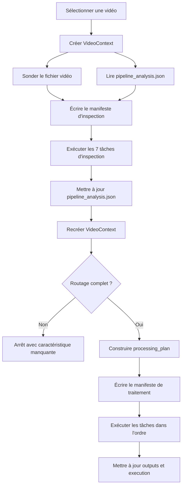

# RAG IONIS

Pipeline local de préparation de vidéos et interface RAG.

## Principe

Chaque vidéo est d'abord inspectée. Le pipeline produit ensuite
`metadata/video_manifest.json`, qui contient :

- les caractéristiques techniques réellement lues dans le fichier vidéo ;
- les résultats d'inspection visuelle et OCR ;
- les réponses aux règles de routage ;
- le pipeline sélectionné ;
- la liste et la commande exacte de chaque utilitaire ;
- l'état d'exécution de chaque tâche.

Le code n'est plus séparé en dossiers `has_sub` et `no_sub`. Les utilitaires sont
uniques et le plan décide lesquels appeler.

## Architecture

```text
pipeline/
  __main__.py       # point d'entrée de python -m pipeline
  cli.py            # commandes inspect, plan et run
  discovery.py      # sélection all, nombre, ID ou chemin
  probe.py          # lecture durée, codecs, résolution, FPS et audio
  context.py        # caractéristiques normalisées d'une vidéo
  options.py        # options communes validées
  planner.py        # règles de sélection des tâches
  catalog.py        # registre déclaratif des utilitaires
  manifest.py       # génération et mise à jour du JSON
  executor.py       # exécution et suivi des tâches
  orchestrator.py   # inspection, planification et traitement
  support/          # chemins et helpers internes partagés
  ingest/           # métadonnées YouTube et téléchargement
  publish/          # upload S3 et synchronisation PostgreSQL
  steps/
    inspection/     # frames, classification, interview, type et détection
    ocr/            # préparation, filtrage et revue des textes visuels
    transcripts/    # OCR, Whisper, corrections et enrichissement
    speakers/       # proposition, validation et diarisation
    chunks/         # chunks courts et hiérarchie des vidéos longues
    embeddings/     # embeddings des chunks

downloads/youtube/init/
  VIDEO_ID/
    VIDEO_ID.mp4
    metadata/
      video_manifest.json
      pipeline_analysis.json
    outputs/
      images/
      interview/
      ocr/
      speakers/
      transcripts_ocr/ ou transcripts_whisper/
      chunks/
```

### Pourquoi tout est dans `pipeline/`

Le package `pipeline` contient l'ensemble du cycle de traitement vidéo. Il n'y a
plus un orchestrateur d'un côté et des scripts indépendants de l'autre :

- la racine de `pipeline/` prend les décisions et pilote les exécutions ;
- `pipeline/steps/` contient les traitements métier exécutables ;
- `pipeline/support/` contient uniquement les fonctions internes partagées ;
- `pipeline/ingest/` prépare les entrées ;
- `pipeline/publish/` envoie les résultats vers S3 et PostgreSQL.

Une étape métier peut toujours être lancée seule avec `python -m`, mais son
utilisation normale passe par le catalogue et le planificateur.

L'ingestion et la publication encadrent le traitement local, mais ne font pas
partie de `processing_plan()`. Elles restent des commandes explicites pour éviter
qu'un simple retraitement vidéo ne télécharge, n'upload ou ne modifie la base par
surprise.

### Responsabilité des modules

| Module | Responsabilité |
|---|---|
| `cli.py` | Parse la commande, les options et le sélecteur de vidéos. |
| `discovery.py` | Trouve les vidéos et applique les sélecteurs `all`, nombre, ID ou chemin. |
| `probe.py` | Lit directement le fichier vidéo avec FFmpeg : durée, codecs, résolution, FPS, audio et rotation. |
| `context.py` | Regroupe les informations techniques et les résultats d'analyse dans un `VideoContext`. |
| `options.py` | Valide les options communes transmises aux étapes. |
| `catalog.py` | Associe chaque identifiant métier à son module Python et construit sa commande. |
| `planner.py` | Produit la liste ordonnée des tâches selon les caractéristiques de la vidéo. |
| `manifest.py` | Sérialise les caractéristiques, les décisions, les commandes et les états d'exécution. |
| `executor.py` | Lance les tâches dans l'ordre, arrête le traitement en cas d'erreur et met à jour le manifeste. |
| `orchestrator.py` | Coordonne les commandes `inspect`, `plan` et `run`. |
| `steps/` | Contient les modules métier avec leur propre CLI. |
| `support/` | Fournit les chemins, l'accès à `pipeline_analysis.json` et les helpers OCR. |

Les modules de `support/` ne doivent pas être ajoutés au catalogue : ils ne sont
pas des étapes autonomes.

La séparation interne suit trois règles :

- `catalog.py` sait comment lancer une tâche, mais ne décide pas quand la lancer ;
- `planner.py` décide quelles tâches lancer et dans quel ordre, mais ne construit
  pas les commandes ;
- une étape produit ses propres sorties, mais n'appelle jamais directement
  l'étape suivante.

Cette séparation permet de modifier une commande sans toucher aux règles métier,
ou de changer une règle de routage sans réécrire les utilitaires.

### Cycle de vie d'une vidéo

Le traitement standard exécuté par `python -m pipeline run VIDEO_ID` suit ce
flux :



En pratique :

1. `discovery.py` résout le sélecteur en chemin vidéo.
2. `VideoContext.inspect()` appelle `probe_video()` et lit les observations déjà
   présentes dans `metadata/pipeline_analysis.json`.
3. L'inspection visuelle et OCR calcule `video_type` et `has_subtitles`.
4. Un nouveau contexte est créé pour prendre en compte ces résultats.
5. `processing_plan()` choisit la branche de transcript et le profil de chunks.
6. `catalog.py` transforme chaque tâche en commande Python complète.
7. `executor.py` exécute ces commandes séquentiellement.
8. Le manifeste est mis à jour avant et après chaque tâche.

### Sources de vérité

Les informations sont volontairement réparties selon leur nature :

| Fichier ou dossier | Contenu | Gestion |
|---|---|---|
| `VIDEO_ID.mp4` | Source technique pour la durée, les codecs et la résolution. | Entrée, jamais modifiée. |
| `metadata/pipeline_analysis.json` | Observations produites par l'inspection, puis statuts et chemins utiles écrits par certaines étapes. | Mis à jour par les étapes d'inspection et de traitement. |
| `metadata/video_manifest.json` | Instantané généré du contexte, des réponses, de la route, des options, du plan et de l'exécution. | Réécrit par l'orchestrateur ; ne pas modifier manuellement. |
| `outputs/` | Frames, OCR, transcripts, speakers, chunks et embeddings. | Généré par les étapes métier. |

`pipeline_analysis.json` décrit donc ce qui a été observé et produit pour la vidéo.
`video_manifest.json` décrit ce que le pipeline a décidé d'en faire et où en est
son exécution.

## Règles de routage

La durée est sondée directement dans la vidéo, sans dépendre des métadonnées
YouTube.

| Caractéristique | Décision |
|---|---|
| durée `> 600` secondes | chunks longs + résumés de sections + résumé global |
| durée `<= 600` secondes | chunks courts |
| sous-titres incrustés détectés | transcript OCR |
| pas de sous-titres incrustés | transcript WhisperX |
| interview, motion design ou captation | variante visuelle enregistrée dans la route |

Exemples de routes :

```text
short.ocr.motion_design
short.whisper.interview
long.ocr.video_recording
long.whisper.video_recording
```

Le seuil est strict : une vidéo de exactement 600 secondes reste courte.

La route possède trois dimensions :

```text
<chunk_strategy>.<transcript_strategy>.<visual_strategy>
```

- `chunk_strategy` vaut `short` ou `long` ;
- `transcript_strategy` vaut `ocr` ou `whisper` ;
- `visual_strategy` vaut actuellement `interview`, `motion_design` ou
  `video_recording`.

Le type visuel est conservé dans la route et peut être consommé par les étapes
métier. Il ne crée pas encore à lui seul une liste de tâches entièrement
différente dans `planner.py`. Par exemple, le cas `motion_design` est utilisé par
les utilitaires de transcript pour retomber sur les textes visibles lorsque la
transcription audio est vide.

## Plans d'exécution

### Inspection commune

L'inspection est identique pour toutes les vidéos et respecte cet ordre :

| Ordre | Identifiant | Module | Résultat principal |
|---:|---|---|---|
| 1 | `frames.extract` | `steps.inspection.extract_frames` | Frames échantillonnées dans `outputs/images/`. |
| 2 | `frames.classify` | `steps.inspection.classify_frames` | Classification footage, graphic ou mixture. |
| 3 | `video.detect_interview` | `steps.inspection.detect_interviews` | Indice d'interview dans `outputs/interview/`. |
| 4 | `video.infer_type` | `steps.inspection.infer_video_type` | `video_type` dans `pipeline_analysis.json`. |
| 5 | `ocr.extract_raw` | `steps.inspection.extract_raw_ocr` | OCR brut dans `outputs/ocr/`. |
| 6 | `ocr.extract_boxes` | `steps.inspection.extract_ocr_boxes` | Positions des zones de texte. |
| 7 | `video.detect_subtitles` | `steps.inspection.detect_subtitles` | `has_subtitles` et ses détails dans `pipeline_analysis.json`. |

La durée n'est pas une étape d'inspection : elle est obtenue immédiatement par
`probe.py` à partir du fichier vidéo.

### Traitements communs

Toutes les routes commencent par la préparation des textes visibles :

```text
ocr.build_processed
ocr.filter_overlays
ocr.extract_review_candidates
ocr.review_other_text
ocr.apply_review
```

Cette partie reste commune car l'OCR est utilisé aussi bien pour extraire des
sous-titres que pour enrichir ou corriger une transcription Whisper.

### Branche avec sous-titres OCR

Lorsque `has_subtitles=true`, le plan ajoute :

```text
transcript.extract_ocr
transcript.correct_ocr_spacing
transcript.normalize_brand
speakers.propose
speakers.validate
speakers.assign_ocr
transcript.create_plain
transcript.enrich
```

Le transcript principal est construit depuis les sous-titres incrustés. WhisperX
n'est pas lancé.

### Branche sans sous-titres

Lorsque `has_subtitles=false`, le plan ajoute :

```text
transcript.whisper
speakers.propose
speakers.validate
transcript.correct_whisper
transcript.enrich
transcript.create_plain
```

WhisperX produit le transcript audio et la diarisation. Les résultats OCR restent
utilisés pour corriger les noms propres et ajouter les textes visibles.

### Vidéos courtes et longues

Les deux branches de transcript se terminent par les tâches suivantes :

| Profil | Tâches finales |
|---|---|
| `short` | `chunks.create` avec le profil court, puis `embeddings.create`. |
| `long` | `chunks.create` avec le profil long, `chunks.summarize_sections`, `chunks.summarize_video`, puis `embeddings.create`. |

Le profil long produit trois niveaux de chunks :

```text
global
└── section
    └── detail
```

Les relations logiques entre ces niveaux sont ensuite converties en
`chunk_parent_id` pendant la synchronisation PostgreSQL.

### Matrice synthétique

| Durée | Sous-titres | Transcript | Chunks | Route type |
|---|---|---|---|---|
| `<= 600 s` | oui | OCR | détails uniquement | `short.ocr.<type>` |
| `<= 600 s` | non | WhisperX | détails uniquement | `short.whisper.<type>` |
| `> 600 s` | oui | OCR | détails + sections + global | `long.ocr.<type>` |
| `> 600 s` | non | WhisperX | détails + sections + global | `long.whisper.<type>` |

## Manifeste JSON

Extrait simplifié :

```json
{
  "schema_version": 2,
  "video": {
    "id": "LJ-W6BjSJRo",
    "duration_seconds": 742.4,
    "width": 1280,
    "height": 720,
    "fps": 25.0,
    "video_codec": "h264",
    "audio_codec": "aac",
    "has_audio": true
  },
  "questions": {
    "longer_than_10_minutes": {
      "answer": true,
      "threshold_seconds": 600
    },
    "has_embedded_subtitles": {
      "answer": false
    },
    "is_motion_design": {
      "answer": false
    },
    "is_interview": {
      "answer": true
    }
  },
  "features": {
    "duration": {
      "threshold_seconds": 600,
      "longer_than_10_minutes": true
    },
    "has_subtitles": {
      "value": false
    },
    "video_type": "interview",
    "motion_design": false,
    "interview": true
  },
  "routing": {
    "status": "ready",
    "pipeline_id": "long.whisper.interview",
    "transcript_strategy": "whisper",
    "chunk_strategy": "long",
    "visual_strategy": "interview"
  },
  "plan": {
    "tasks": [
      {
        "id": "transcript.whisper",
        "reason": "has_subtitles=false",
        "command": [
          "python",
          "-m",
          "pipeline.steps.transcripts.transcribe_with_whisper",
          "--video-dir",
          "downloads/youtube/init/LJ-W6BjSJRo"
        ]
      }
    ]
  }
}
```

### Structure du manifeste

Les sections principales ont chacune un rôle précis :

| Section | Description |
|---|---|
| `video` | Informations techniques retournées par `probe.py`. |
| `questions` | Réponses lisibles aux questions métier de routage. |
| `features` | Valeurs normalisées utilisées par le code. |
| `routing` | Route calculée, stratégies choisies et caractéristiques manquantes. |
| `options` | Options effectives utilisées pour générer le plan. |
| `plan.tasks` | Liste ordonnée des tâches avec leur raison et leur commande exacte. |
| `execution` | État global et état horodaté de chaque tâche exécutée. |

Avant la fin de l'inspection, une réponse peut valoir `null` et le routage peut
ressembler à ceci :

```json
{
  "routing": {
    "status": "needs_content_inspection",
    "pipeline_id": "short",
    "transcript_strategy": null,
    "chunk_strategy": "short",
    "visual_strategy": null,
    "missing_features": [
      "has_subtitles",
      "video_type"
    ]
  }
}
```

Après chaque lancement réel, `execution.status` vaut l'un des états suivants :

| État | Signification |
|---|---|
| `not_started` | Le plan a été généré mais n'a pas encore été exécuté. |
| `running` | Une exécution est en cours. |
| `completed` | Toutes les tâches du lancement sont terminées. |
| `failed` | Une tâche a échoué et l'exécution s'est arrêtée. |

Chaque entrée de `execution.tasks` peut contenir `started_at`, `finished_at` et
`error`. Les dates sont enregistrées en UTC.

`plan` représente le plan actuellement proposé, tandis que `execution` conserve
les tâches déjà exécutées. Après une commande `inspect`, il est donc normal que :

- `plan.tasks` contienne déjà le futur plan de traitement ;
- `execution.tasks` contienne les sept tâches d'inspection terminées.

Une commande `plan` conserve également l'historique d'exécution existant lorsqu'elle
réécrit le manifeste.

## Installation

Le projet utilise un environnement Python unique :

```powershell
py -3.10 -m venv .venv
.\.venv\Scripts\python.exe -m pip install --upgrade pip setuptools wheel
.\.venv\Scripts\python.exe -m pip install -r requirements.txt
Copy-Item .env.example .env
```

Variables principales :

```text
YOUTUBE_API_KEY=...
OPENAI_API_KEY=...
HUGGINGFACE_TOKEN=...

WHISPERX_MODEL=large-v3
WHISPERX_LANGUAGE=fr
WHISPERX_DEVICE=cuda
WHISPERX_COMPUTE_TYPE=float16
WHISPERX_BATCH_SIZE=16

S3_BUCKET_NAME=...
S3_REGION=...
S3_ACCESS_KEY_ID=...
S3_SECRET_ACCESS_KEY=...
```

## Utilisation du pipeline

### Comportement des commandes

| Commande | Effet |
|---|---|
| `inspect --probe-only` | Sonde seulement le fichier et écrit un manifeste contenant le plan d'inspection. Aucun traitement visuel ou OCR n'est lancé. |
| `inspect` | Sonde la vidéo, exécute les sept tâches d'inspection, recharge le contexte puis écrit le plan de traitement sélectionné. |
| `plan` | N'exécute aucune tâche. Si le routage est complet, écrit le plan de traitement ; sinon écrit le plan d'inspection. |
| `plan --include-inspection` | Force l'écriture du plan d'inspection même si les caractéristiques sont déjà connues. |
| `run` | Exécute l'inspection, recalcule la route, puis exécute le plan de traitement. |
| `run --skip-inspection` | Réutilise `pipeline_analysis.json` si le routage est complet. Si une caractéristique manque, l'inspection est quand même exécutée. |

Les commandes `plan` et `--dry-run` ne modifient pas les sorties métier.
`plan` écrit néanmoins le manifeste, puisque celui-ci constitue le résultat de la
planification.

Sonder uniquement les informations techniques et écrire le JSON :

```powershell
.\.venv\Scripts\python.exe -m pipeline inspect 1 --probe-only
```

Inspecter le contenu d'une vidéo puis générer sa route :

```powershell
.\.venv\Scripts\python.exe -m pipeline inspect VIDEO_ID
```

Générer ou régénérer le plan sans exécuter les traitements :

```powershell
.\.venv\Scripts\python.exe -m pipeline plan VIDEO_ID
.\.venv\Scripts\python.exe -m pipeline plan VIDEO_ID --include-inspection
```

Exécuter l'inspection puis le pipeline sélectionné :

```powershell
.\.venv\Scripts\python.exe -m pipeline run VIDEO_ID
```

Sélecteurs acceptés :

```powershell
.\.venv\Scripts\python.exe -m pipeline run 3
.\.venv\Scripts\python.exe -m pipeline run all
.\.venv\Scripts\python.exe -m pipeline run downloads/youtube/init/VIDEO_ID
.\.venv\Scripts\python.exe -m pipeline run downloads/youtube/init/VIDEO_ID/VIDEO_ID.mp4
```

Options utiles :

```powershell
.\.venv\Scripts\python.exe -m pipeline run VIDEO_ID --dry-run
.\.venv\Scripts\python.exe -m pipeline run VIDEO_ID --force
.\.venv\Scripts\python.exe -m pipeline run VIDEO_ID --skip-inspection
.\.venv\Scripts\python.exe -m pipeline run VIDEO_ID --openai-mode batch
.\.venv\Scripts\python.exe -m pipeline run VIDEO_ID --review-scope all
.\.venv\Scripts\python.exe -m pipeline run VIDEO_ID --correction-mode conservative
```

Par défaut, la racine vidéo est `downloads/youtube/init`. Elle peut être changée
avec `--root`.

### Sélecteurs

Le sélecteur positionnel accepte :

| Valeur | Sélection |
|---|---|
| `all` | Toutes les vidéos valides trouvées sous `--root`. |
| nombre positif | Les N premières vidéos, triées par chemin. |
| `VIDEO_ID` | La vidéo dont le fichier ou le dossier porte cet identifiant. |
| chemin de dossier | L'unique vidéo présente directement dans ce dossier. |
| chemin de fichier | Ce fichier vidéo précis. |

Un dossier vidéo doit contenir exactement un fichier `.mp4`, `.mkv`, `.webm`,
`.mov` ou `.m4v` directement à sa racine.

### Options communes

| Option | Effet |
|---|---|
| `--force` | Transmet `--force` aux étapes du plan afin de régénérer leurs sorties. |
| `--dry-run` | Affiche les commandes sans les exécuter. |
| `--openai-mode normal|batch` | Choisit le mode global des appels OpenAI compatibles. |
| `--review-scope duo|all` | En mode `duo`, limite la revue des textes visuels à une image par vidéo. |
| `--image-review-model` | Remplace le modèle de revue des textes visuels. |
| `--speaker-validation-model` | Remplace le modèle utilisé pour valider les speakers et corriger les espaces OCR. |
| `--correction-mode` | Règle le niveau de correction Whisper : `conservative`, `balanced` ou `aggressive`. |
| `--frame-interval` | Intervalle en secondes entre les frames extraites. |
| `--details-per-section` | Nombre de chunks détail regroupés dans une section pour les vidéos longues. |

Pour afficher le plan de traitement en dry-run, il faut disposer d'un
`pipeline_analysis.json` complet :

```powershell
.\.venv\Scripts\python.exe -m pipeline run VIDEO_ID --skip-inspection --dry-run
```

Sans `--skip-inspection`, `run --dry-run` affiche uniquement les commandes
d'inspection et s'arrête avant de simuler le plan aval, puisque les nouvelles
caractéristiques n'ont pas réellement été calculées.

### Erreurs et reprise

L'exécuteur lance les tâches séquentiellement et s'arrête à la première commande
qui retourne une erreur :

1. le statut global passe à `failed` ;
2. la tâche concernée passe à `failed` ;
3. le message de l'exception est enregistré dans `execution.tasks.<id>.error` ;
4. les tâches suivantes ne sont pas exécutées.

Il n'existe pas encore de reprise automatique à partir de la tâche exacte en
échec. En relançant la commande, le plan repart du début. Les utilitaires sont
cependant conçus pour ignorer leurs sorties encore valides, ce qui rend une
relance normale généralement peu coûteuse :

```powershell
.\.venv\Scripts\python.exe -m pipeline run VIDEO_ID --skip-inspection
```

Utiliser `--force` uniquement lorsqu'il faut réellement reconstruire les sorties :

```powershell
.\.venv\Scripts\python.exe -m pipeline run VIDEO_ID --skip-inspection --force
```

## Maintenir et étendre le pipeline

### Ajouter une nouvelle étape métier

Une étape doit rester autonome et pouvoir être lancée avec `python -m`.

1. Créer le module dans le domaine approprié :

   ```text
   pipeline/steps/ocr/
   pipeline/steps/transcripts/
   pipeline/steps/speakers/
   pipeline/steps/chunks/
   pipeline/steps/embeddings/
   ```

2. Exposer une fonction `main()` et une CLI `argparse`. L'étape doit accepter
   `--video-dir`. Si elle régénère des sorties, elle devrait aussi accepter
   `--force`.

3. Écrire les sorties sous `metadata/` ou `outputs/`, en utilisant
   `pipeline.support.paths` pour conserver une arborescence homogène.

4. Déclarer l'étape dans `TASKS` dans `pipeline/catalog.py` :

   ```python
   "transcript.clean": TaskSpec(
       "transcript.clean",
       "processing",
       "Nettoyer le transcript",
       "pipeline.steps.transcripts.clean_transcript",
   )
   ```

5. Ajouter ses arguments spécifiques dans `task_args()` si nécessaire.

6. Ajouter l'identifiant dans la bonne séquence de `pipeline/planner.py`, ou
   l'insérer selon une nouvelle condition.

7. Ajouter un test vérifiant au minimum :

   - que la bonne route contient la tâche ;
   - que les autres routes ne la contiennent pas si elle est conditionnelle ;
   - que la commande sérialisée dans le manifeste pointe vers le bon module.

8. Vérifier son point d'entrée :

   ```powershell
   .\.venv\Scripts\python.exe -m pipeline.steps.transcripts.clean_transcript --help
   ```

Une étape ne doit pas appeler directement l'étape suivante. L'ordre appartient à
`planner.py` et l'exécution appartient à `executor.py`.

### Ajouter une règle de routage

Pour ajouter une caractéristique qui influence le pipeline :

1. produire ou lire sa valeur dans une étape d'inspection ;
2. la stocker dans `metadata/pipeline_analysis.json` ;
3. l'exposer dans `VideoContext` ;
4. l'ajouter aux sections `questions`, `features` ou `routing` du manifeste ;
5. modifier `processing_plan()` pour sélectionner les tâches concernées ;
6. ajouter les scénarios limites dans `tests/test_pipeline_routing.py`.

Une valeur nécessaire au routage doit être signalée dans
`routing.missing_features` lorsqu'elle est absente. Cela empêche le traitement de
partir silencieusement dans une branche par défaut.

### Ajouter un helper partagé

Un helper sans CLI va dans `pipeline/support/`. Il peut être importé par plusieurs
étapes, mais ne doit pas être enregistré dans `TASKS`.

Exemples :

- résolution des chemins de sorties ;
- lecture et mise à jour de `pipeline_analysis.json` ;
- primitives PaddleOCR ;
- filtrage géométrique ou textuel partagé.

### Modifier une option globale

Une option qui doit apparaître dans le manifeste et être disponible pour
plusieurs tâches doit être ajoutée aux quatre endroits suivants :

1. `PipelineOptions` dans `options.py` ;
2. la CLI dans `cli.py` ;
3. `options_from_args()` ;
4. `task_args()` ou `task_environment()` selon la manière dont les étapes la
   consomment.

Les valeurs de `PipelineOptions` sont sérialisées dans `manifest.options`, ce qui
permet de reproduire le plan généré.

## Ingestion

Charger les métadonnées YouTube dans PostgreSQL :

```powershell
.\.venv\Scripts\python.exe -m pipeline.ingest.fetch_youtube_metadata
```

Télécharger ou compléter les vidéos locales :

```powershell
.\.venv\Scripts\python.exe -m pipeline.ingest.download_videos
```

Chaque dossier vidéo doit contenir exactement un fichier vidéo à sa racine. Les
autres fichiers sont générés dans `metadata/` et `outputs/`.

## Publication

Uploader les vidéos et leurs sorties :

```powershell
.\.venv\Scripts\python.exe -m pipeline.publish.upload_outputs_to_s3
.\.venv\Scripts\python.exe -m pipeline.publish.upload_outputs_to_s3 --dry-run
```

Synchroniser les métadonnées, transcripts et chunks dans PostgreSQL :

```powershell
.\.venv\Scripts\python.exe -m pipeline.publish.sync_database
.\.venv\Scripts\python.exe -m pipeline.publish.sync_database --dry-run
```

Les chunks longs sont stockés avec les niveaux `detail`, `section` et `global`.
Les embeddings utilisent `text-embedding-3-large` en 2000 dimensions.

## Base de données

Démarrer PostgreSQL et Phoenix :

```powershell
docker compose up -d postgres phoenix
```

Vider les tables applicatives en conservant le schéma :

```powershell
.\.venv\Scripts\python.exe utils/clear_database.py
```

Recréer le schéma complet :

```powershell
.\.venv\Scripts\python.exe utils/reset_database.py
```

Le schéma source est `docker/postgres/init/001_schema.sql`.

## Interface RAG

Démarrer l'API et l'interface :

```powershell
.\.venv\Scripts\python.exe -m uvicorn interface.app:app --host 127.0.0.1 --port 8000
```

- interface : `http://127.0.0.1:8000/`
- santé API : `http://127.0.0.1:8000/health`
- Phoenix : `http://127.0.0.1:6006/`

Le backend combine recherche SQL, BM25, recherche vectorielle pgvector, fusion RRF
et reranking. Les traces OpenTelemetry sont envoyées à Phoenix lorsque
`PHOENIX_ENABLED=true`.

## Tests

```powershell
.\.venv\Scripts\python.exe -m unittest discover -s tests -p "test*.py"
```
