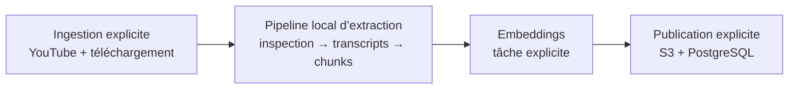
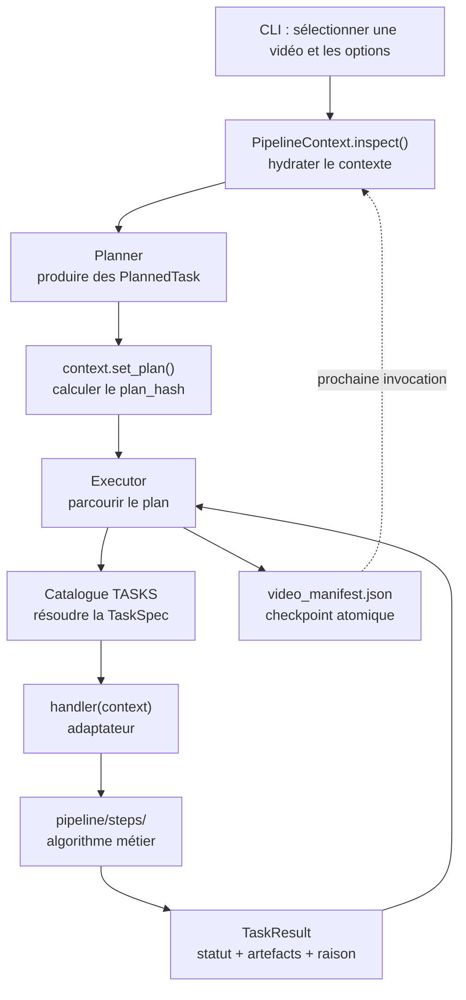

# Mémo technique — pipeline d’extraction de données

## 1. Réponse courte : quel pattern est utilisé ?

Le code utilise principalement un **Pipeline Context pattern** :

- un objet mutable unique, `PipelineContext`, représente l’état de travail d’une
  vidéo ;
- le même objet traverse l’inspection, la planification et toutes les tâches ;
- chaque handler reçoit ce contexte et retourne un résultat explicite ;
- le contexte est projeté régulièrement dans
  `metadata/video_manifest.json`, qui sert de checkpoint durable.

Ce pattern est combiné avec quatre autres mécanismes :

- un **Planner**, qui décide quelles tâches exécuter et dans quel ordre ;
- un **Task Registry**, qui associe chaque identifiant de tâche à son handler ;
- un **Executor**, qui applique le plan et gère les statuts ;
- du **Checkpointing**, qui permet de reprendre une exécution interrompue.

Le modèle mental le plus fidèle est donc :

```text
Pipeline Context
+ Ordered Pipeline
+ Task Registry
+ Orchestrator
+ Checkpoint/Resume
```

Ce n’est pas un objet `Pipeline` contenant une chaîne de méthodes, ni un DAG
générique. Le plan courant est une **liste linéaire et ordonnée de
`PlannedTask`**. Les dépendances entre tâches sont implicites dans cet ordre.

---

## 2. Périmètre complet de la chaîne data

Le dépôt contient trois grandes zones, volontairement séparées :



### 2.1 Ingestion

Les commandes de [`pipeline/ingest/`](../pipeline/ingest/) préparent les entrées :

- récupération des métadonnées YouTube ;
- téléchargement ou réutilisation de la vidéo ;
- création de `metadata/youtube_video_metadata.json`.

### 2.2 Extraction locale

`python -m pipeline run VIDEO_ID` prend une vidéo déjà ingérée et produit
principalement :

- frames et résultats d’inspection ;
- OCR ;
- transcript WhisperX ;
- corrections et enrichissements ;
- identification des speakers ;
- chunks de détail ;
- résumés hiérarchiques pour les vidéos longues.

### 2.3 Embeddings

`embeddings.create` appartient au registre des tâches, mais n’est volontairement
pas ajouté au plan standard de `pipeline run`.

Il faut le lancer séparément :

```powershell
.\.venv\Scripts\python.exe -m pipeline task embeddings.create VIDEO_ID
```

### 2.4 Publication

Les commandes de [`pipeline/publish/`](../pipeline/publish/) sont explicites :

- upload des fichiers vers S3 ;
- synchronisation des vidéos, transcripts, speakers et chunks vers PostgreSQL.

L’ingestion et la publication ne font pas partie de `processing_plan()`. Ainsi,
un retraitement local ne télécharge, n’upload et ne modifie pas la base par
surprise.

---

## 3. Organisation des fichiers

```text
pipeline/
  __main__.py
  cli.py
  discovery.py
  probe.py

  contracts.py
  options.py
  context.py

  planner.py
  catalog.py
  step_handlers.py
  executor.py
  manifest.py
  orchestrator.py

  steps/
    inspection/
    ocr/
    transcripts/
    speakers/
    chunks/
    embeddings/

  support/
  workers/
  ingest/
  publish/
```

### Responsabilité de chaque couche

| Fichier ou dossier | Responsabilité |
|---|---|
| [`cli.py`](../pipeline/cli.py) | Parse `inspect`, `plan`, `run`, `task`, les options et les sélecteurs. |
| [`discovery.py`](../pipeline/discovery.py) | Résout `all`, un nombre, un ID ou un chemin en fichiers vidéo. |
| [`probe.py`](../pipeline/probe.py) | Lit les caractéristiques techniques du média avec FFmpeg. |
| [`contracts.py`](../pipeline/contracts.py) | Définit les objets échangés entre les couches. |
| [`options.py`](../pipeline/options.py) | Définit et valide les options globales. |
| [`context.py`](../pipeline/context.py) | Porte l’état mutable, les artefacts, les hashes et la reprise. |
| [`planner.py`](../pipeline/planner.py) | Produit la liste ordonnée des tâches selon le routage. |
| [`catalog.py`](../pipeline/catalog.py) | Associe un `task_id` à une `TaskSpec` et un handler. |
| [`step_handlers.py`](../pipeline/step_handlers.py) | Adapte `PipelineContext` aux fonctions métier. |
| [`executor.py`](../pipeline/executor.py) | Exécute, valide, checkpoint et reprend les tâches. |
| [`manifest.py`](../pipeline/manifest.py) | Valide et sérialise le contexte dans le manifeste v4. |
| [`orchestrator.py`](../pipeline/orchestrator.py) | Coordonne les scénarios publics `inspect`, `plan` et `run`. |
| [`steps/`](../pipeline/steps/) | Contient les traitements métier et leurs sorties. |
| [`support/`](../pipeline/support/) | Contient les helpers partagés, mais aucune étape autonome. |

Trois règles structurantes évitent le couplage :

1. le catalogue sait **quelle fonction** appeler, mais pas quand ;
2. le planner sait **quelles tâches** sélectionner et dans quel ordre, mais ne
   les exécute pas ;
3. une étape métier produit sa sortie, mais n’appelle jamais directement
   l’étape suivante.

---

## 4. Vue d’ensemble du flux technique



Une tâche respecte normalement cette signature :

```python
def handler(context: PipelineContext) -> TaskResult:
    ...
```

Le handler ne reçoit donc pas quinze paramètres séparés. Il extrait du contexte
les informations dont son traitement a besoin :

```python
result = process_video(
    context.video_path,
    force=context.force_rebuild,
    model=context.options.chunk_summary_model,
)
```

---

## 5. `PipelineContext` : l’agrégat central

[`PipelineContext`](../pipeline/context.py) est l’objet de travail unique d’une
vidéo.

Il est mutable par choix : les handlers enrichissent progressivement le même
état. En revanche, plusieurs petits contrats qu’il contient sont immuables
(`frozen=True`) afin de rendre leurs mises à jour explicites.

### 5.1 Champs principaux

| Champ | Rôle |
|---|---|
| `video_path` | Fichier vidéo effectivement traité. |
| `options` | Options effectives de l’invocation. |
| `media` | Résultat du probe technique, plus la durée de référence. |
| `source_metadata` | Métadonnées YouTube chargées depuis le JSON source. |
| `routing_facts` | Faits persistants qui déterminent la route. |
| `artifacts` | Chemins produits, regroupés par tâche. |
| `plan` | Liste ordonnée de `PlannedTask`. |
| `execution` | Exécution active associée au hash du plan. |
| `execution_history` | Exécutions archivées pour les anciens plans. |
| `_task_force` | Drapeau interne et temporaire utilisé par l’exécuteur. |

### 5.2 Propriétés dérivées

Le contexte expose aussi des propriétés calculées :

- `video_id` et `video_url` ;
- `metadata_dir`, `outputs_dir` et `manifest_path` ;
- `duration_seconds` ;
- `is_long_video` ;
- `has_subtitles` et `video_type` ;
- `transcript_strategy` ;
- `chunk_strategy` ;
- `routing_ready`.

La route est une **vue dérivée**. Elle ne doit pas être modifiée directement.
La source de vérité du routage est `routing_facts`.

### 5.3 Ce que fait réellement `PipelineContext.inspect()`

Le nom peut prêter à confusion :

- `PipelineContext.inspect()` hydrate le contexte ;
- la commande CLI `pipeline inspect` exécute en plus les détecteurs visuels et
  OCR.

`PipelineContext.inspect()` suit cette séquence :

1. si l’entrée est un dossier, vérifier qu’il contient exactement une vidéo ;
2. lire et valider `metadata/video_manifest.json` s’il existe ;
3. restaurer les faits de routage, le plan, les artefacts et les exécutions ;
4. migrer au besoin les anciennes structures v3 ou
   `pipeline_analysis.json` ;
5. relire `metadata/youtube_video_metadata.json` ;
6. reprober le fichier vidéo ;
7. utiliser la durée YouTube comme durée de référence ;
8. restaurer les options du manifeste si aucune option n’a été fournie ;
9. forcer `video_type=long_video` lorsque la durée est strictement supérieure à
   600 secondes ;
10. reconstruire le `PipelineContext`.

Le contexte n’est donc pas désérialisé aveuglément. Le manifeste est une
projection explicite de son état durable ; les informations source et média
sont relues.

### 5.4 Exemple de mutation d’un fait

`RoutingFacts` est immuable. Un handler le remplace explicitement :

```python
from dataclasses import replace

context.routing_facts = replace(
    context.routing_facts,
    video_type=VideoType.MOTION_DESIGN,
)
```

Cela permet de conserver les autres faits, par exemple
`has_subtitles_details`, tout en rendant la mutation visible dans le code.

---

## 6. Les contrats et leur différence

Les noms sont proches, mais chaque objet représente une question différente :

| Contrat | Question à laquelle il répond |
|---|---|
| `RoutingFacts` | Quels faits métier persistants déterminent la route ? |
| `PlannedTask` | Quelle tâche le planner a-t-il sélectionnée, et pourquoi ? |
| `TaskSpec` | Quelle implémentation correspond à cet identifiant ? |
| `TaskResult` | Que vient de retourner le handler ? |
| `TaskExecution` | Que sait-on durablement de l’exécution de cette tâche ? |
| `RunExecution` | Quel est l’état global de ce plan précis ? |
| `PipelineArtifacts` | Quels fichiers ou dossiers cette tâche possède-t-elle ? |

### 6.1 `VideoType`

Valeurs autorisées :

```text
interview
long_video
motion_design
video_recording
```

La conversion normalise la casse et les espaces. Une autre valeur provoque une
erreur : le routage ne part pas silencieusement vers une branche par défaut.

### 6.2 `RoutingFacts`

```python
@dataclass(frozen=True)
class RoutingFacts:
    has_subtitles: bool | None = None
    video_type: VideoType | None = None
    has_subtitles_details: dict[str, Any] | None = None
```

`None` signifie « pas encore déterminé », pas `False`.

Le routage est prêt lorsque :

- `video_type` est connu ;
- `has_subtitles` est connu pour une vidéo courte ;
- pour `long_video`, la détection des sous-titres n’est pas requise.

### 6.3 `PlannedTask`

Le planner produit un objet minimal :

```python
PlannedTask(
    id="transcript.whisper",
    reason="canonical_transcript=whisperx",
)
```

Il contient :

- l’identifiant stable de la tâche ;
- la raison pour laquelle cette tâche appartient au plan.

La `reason` n’est pas seulement documentaire : elle participe au `plan_hash`.
Elle doit donc rester stable ou changer volontairement.

Lors de la sérialisation du manifeste, `PlannedTask.to_dict()` consulte le
catalogue pour ajouter :

- la phase ;
- le titre ;
- le chemin Python du handler ;
- la version de la tâche.

### 6.4 `TaskSpec`

Une `TaskSpec` appartient au catalogue :

```python
TaskSpec(
    id="transcript.whisper",
    phase="processing",
    title="Transcrire l'audio avec WhisperX",
    handler=step_handlers.transcribe_whisper,
    version="1",
    postcondition=None,
)
```

Ses champs signifient :

| Champ | Signification |
|---|---|
| `id` | Identifiant métier stable et unique. |
| `phase` | `inspection` ou `processing`. |
| `title` | Libellé humain. |
| `handler` | Fonction `PipelineContext -> TaskResult`. |
| `version` | Version logique de la tâche et de ses sorties. |
| `postcondition` | Vérification métier optionnelle de complétion. |

`phase` est actuellement une métadonnée sérialisée dans le manifeste. Elle
intervient indirectement dans le hash : le calcul vérifie si le plan est
exclusivement composé de tâches d’inspection pour décider d’y inclure ou non les
faits de routage. L’exécuteur ne construit pas deux moteurs différents selon la
phase.

`version` doit être incrémentée lorsque la signification ou le format d’une
sortie devient incompatible avec un ancien checkpoint.

### 6.5 `TaskResult`

Tout handler doit retourner un `TaskResult` terminal :

```python
TaskResult.succeeded(...)
TaskResult.cached(...)
TaskResult.skipped(...)
TaskResult.blocked(...)
TaskResult.failed(...)
```

Champs :

```python
status: TaskStatus
artifacts: tuple[str | Path, ...]
reason: str | None
value: Any
```

Différence importante :

- `artifacts` décrit des sorties durables et reprenables ;
- `value` transporte une valeur utile dans le processus courant.

Un scalaire placé uniquement dans `value` n’est pas persisté dans le manifeste.
Une tâche sans artefact ni postcondition peut réussir pendant l’invocation
courante, mais ne sera généralement pas reprenable au lancement suivant.

### 6.6 `TaskExecution`

`TaskExecution` décrit l’historique persistant d’une tâche :

```python
status
started_at
finished_at
error
reason
attempts
artifact_fingerprint
```

À chaque véritable tentative :

- le statut passe à `running` ;
- l’ancienne erreur, l’ancienne raison et l’ancienne empreinte sont effacées ;
- `attempts` est incrémenté.

### 6.7 `RunExecution`

`RunExecution` regroupe :

- un `run_id` ;
- le `plan_hash` ;
- un statut global ;
- les `TaskExecution` par identifiant ;
- les dates de début et de fin.

Le statut global n’a pas `cached` ni `skipped`. Il vaut :

```text
not_started
running
completed
blocked
failed
```

---

## 7. Statuts des tâches

### 7.1 Tableau de décision

| Statut | Sens | Le pipeline continue ? | Reprenable automatiquement ? |
|---|---|---:|---:|
| `completed` | Le handler a réussi. | Oui | Oui si postcondition ou artefacts valides. |
| `cached` | La sortie existante est valide. | Oui | Oui si la complétion reste valide. |
| `skipped` | Étape facultative non applicable. | Oui | Seulement si une complétion durable peut être vérifiée. |
| `blocked` | Prérequis métier obligatoire absent. | Non | Non, tant que la cause demeure. |
| `failed` | Erreur explicite ou technique. | Non | Non. |

Dans le code Python, le succès s’appelle `TaskStatus.SUCCEEDED`, mais sa valeur
JSON historique reste `"completed"`. `COMPLETED` existe comme alias de
compatibilité, et le lecteur accepte aussi l’ancien mot `"succeeded"`.

### 7.2 `blocked` contre `failed`

Utiliser `blocked` lorsqu’une tâche fonctionne correctement mais ne peut pas
produire son résultat :

```python
if not source.exists():
    return TaskResult.blocked("Transcript source absent.")
```

Utiliser `failed`, ou laisser remonter une exception, lorsqu’il s’agit d’une
erreur :

```python
return TaskResult.failed("Réponse du service invalide.")
```

Conséquences :

- `blocked` marque les tâches aval `skipped` et le run `blocked` ;
- `failed` marque la tâche et le run `failed` ;
- dans les deux cas, l’exécution s’arrête.

### 7.3 `skipped`

`skipped` sert aux étapes réellement facultatives :

```python
if not candidate_frames:
    return TaskResult.skipped(
        "Détection d’interview ignorée : aucune frame footage."
    )
```

La tâche suivante est alors autorisée à s’exécuter.

---

## 8. Le catalogue des tâches

Le dictionnaire global `TASKS` est dérivé de `_TASK_SPECS` dans
[`catalog.py`](../pipeline/catalog.py). Il garantit un identifiant unique.

### 8.1 Tâches d’inspection

| Identifiant | Rôle | Complétion particulière |
|---|---|---|
| `frames.extract` | Extrait périodiquement les images de la vidéo. | Postcondition : au moins une image existe. |
| `frames.classify` | Classe les frames en contenu graphique, footage ou mélange. | Artefact de classification. |
| `video.detect_interview` | Détecte les séquences d’interview parmi les frames. | Artefact d’analyse. |
| `video.infer_type` | Déduit `video_type`. | Postcondition : `context.video_type` connu. |
| `ocr.extract_raw` | Exécute l’OCR brut sur les groupes d’images. | Artefacts OCR bruts. |
| `ocr.extract_boxes` | Extrait les positions géométriques des textes OCR. | Artefact de localisation. |
| `video.detect_subtitles` | Détermine si la vidéo contient des sous-titres incrustés. | Postcondition : `context.has_subtitles` connu. |

### 8.2 Tâches de traitement

| Identifiant | Rôle |
|---|---|
| `ocr.build_processed` | Construit un OCR traité à partir des sorties brutes. |
| `ocr.filter_overlays` | Filtre les overlays visuels qui ne sont pas du transcript. |
| `transcript.extract_ocr` | Construit un transcript timecodé depuis les sous-titres OCR. |
| `transcript.normalize_brand` | Normalise notamment la marque Ionis-STM. |
| `transcript.whisper` | Produit le transcript canonique WhisperX. |
| `speakers.propose` | Propose des identités de speakers. |
| `speakers.validate` | Valide les speakers avec le modèle configuré. |
| `transcript.correct_whisper` | Corrige Whisper à partir de l’OCR visuel sans transcript OCR canonique. |
| `transcript.reconcile_ocr` | Rapproche WhisperX du transcript OCR lorsque des sous-titres existent. |
| `transcript.enrich` | Applique les speakers et ajoute les intercalaires. |
| `transcript.create_plain` | Crée le transcript sans timecodes. |
| `transcript.create_plain_ocr` | Crée la référence OCR plain utilisée pour la correction. |
| `chunks.create` | Crée les chunks de détail. |
| `chunks.summarize_sections` | Ajoute les chunks de niveau section aux vidéos longues. |
| `chunks.summarize_video` | Ajoute le chunk de résumé global. |
| `embeddings.create` | Crée les embeddings des chunks ; lancement séparé. |

### 8.3 Postcondition ou artefacts ?

Par défaut, l’exécuteur considère une tâche complète si ses artefacts enregistrés
sont valides.

Si une `TaskSpec` déclare une `postcondition`, celle-ci devient le critère de
complétion prioritaire.

Exemples :

- `frames.extract` vérifie qu’il existe réellement au moins une image ;
- `video.infer_type` vérifie que le fait `video_type` est défini ;
- `video.detect_subtitles` vérifie que `has_subtitles` n’est plus `None`.

Une postcondition fausse ne peut pas être contournée par la simple présence
d’un fichier.

---

## 9. Routage et planification

### 9.1 Durée de référence

La durée utilisée pour router vient de :

```text
metadata/youtube_video_metadata.json
```

FFmpeg sert à lire le codec, la résolution, le FPS, l’audio et la rotation, mais
pas à décider de la durée de référence.

Le seuil est strict :

```text
duration_seconds > 600  → long
duration_seconds <= 600 → short
```

Une vidéo de exactement 600 secondes reste courte.

### 9.2 Identifiant de route

Le contexte construit :

```text
{chunk_strategy}.{transcript_strategy}.{video_type}
```

Exemples :

```text
short.whisper.motion_design
short.whisper.interview
short.whisper.video_recording
long.whisper.long_video
```

La présence des sous-titres n’est pas encodée directement dans `pipeline_id`,
alors qu’elle change le plan. Elle apparaît dans :

- `routing_facts.has_subtitles` ;
- `route.ocr_correction_reference` ;
- la liste effective des tâches ;
- le `plan_hash` du plan de traitement.

Deux vidéos ayant le même `pipeline_id` peuvent donc avoir des plans différents
selon la présence de sous-titres.

### 9.3 Plan d’inspection d’une vidéo courte

```text
frames.extract
frames.classify
video.detect_interview
video.infer_type
ocr.extract_raw
ocr.extract_boxes
video.detect_subtitles
```

### 9.4 Plan d’inspection d’une vidéo longue

```text
video.infer_type
```

La durée suffit à conclure `long_video`. Les frames et l’OCR d’inspection sont
évités.

### 9.5 Vidéo courte avec sous-titres

```text
ocr.build_processed
ocr.filter_overlays
transcript.whisper
transcript.extract_ocr
transcript.normalize_brand
transcript.create_plain_ocr
transcript.reconcile_ocr
speakers.propose
speakers.validate
transcript.enrich
transcript.create_plain
chunks.create
```

### 9.6 Vidéo courte sans sous-titres

```text
ocr.build_processed
ocr.filter_overlays
transcript.whisper
transcript.correct_whisper
speakers.propose
speakers.validate
transcript.enrich
transcript.create_plain
chunks.create
```

### 9.7 Vidéo longue

```text
transcript.whisper
transcript.create_plain
speakers.propose
speakers.validate
chunks.create
chunks.summarize_sections
chunks.summarize_video
```

Pour une vidéo longue :

- la diarisation WhisperX est ignorée ;
- le plain transcript est créé directement depuis WhisperX brut ;
- les speakers sont recherchés à partir d’un extrait ;
- les chunks sont enrichis avec des sections et un résumé global.

### 9.8 Type visuel contre branche technique

`interview`, `motion_design` et `video_recording` sont bien des dimensions de
routage et apparaissent dans l’identifiant de pipeline.

Actuellement, ces trois types courts ne produisent toutefois pas trois listes de
tâches entièrement différentes. La branche technique principale du processing
court est surtout déterminée par `has_subtitles` :

```text
true  → réconciliation WhisperX / transcript OCR
false → correction WhisperX / OCR visuel
```

---

## 10. `step_handlers.py` : frontière entre orchestration et métier

Les fonctions de [`pipeline/steps/`](../pipeline/steps/) restent des algorithmes
métier. Elles travaillent généralement avec :

- un `video_path` ;
- des paramètres métier ;
- un drapeau `force` ;
- des chemins de sortie.

Les fonctions de [`step_handlers.py`](../pipeline/step_handlers.py) adaptent le
contexte à ces fonctions.

### 10.1 Responsabilités typiques d’un handler

Un handler :

1. importe paresseusement la fonction métier ;
2. résout les chemins attendus ;
3. prend un snapshot des sorties existantes ;
4. lit les options utiles dans le contexte ;
5. appelle la fonction métier ;
6. transforme son retour en `TaskResult` ;
7. met éventuellement à jour un fait de routage.

Les imports locaux évitent aussi de charger trop tôt les bibliothèques lourdes
de ML, OCR ou Whisper.

### 10.2 Exemple : tâche avec artefact

Version simplifiée de `extract_frames` :

```python
def extract_frames(context: PipelineContext) -> TaskResult:
    from pipeline.steps.inspection.extract_frames import extract_images
    from pipeline.support.paths import images_dir

    target = images_dir(context.video_path)
    before = _snapshot(target.glob("*.jpg"))

    result = extract_images(
        context.video_path,
        context.options.frame_interval_seconds,
        force=context.force_rebuild,
    )

    images = sorted(target.glob("*.jpg"))
    return _artifact_result(
        context,
        result,
        artifacts=(target,),
        state_paths=images,
        before=before,
        success_reason=f"{len(images)} frame(s) extraite(s).",
        cached_reason=f"{len(images)} frame(s) déjà extraite(s).",
        missing_reason="L’extraction n’a produit aucune frame.",
    )
```

### 10.3 Exemple : tâche qui établit un fait

Version simplifiée de `infer_video_type` :

```python
def infer_video_type(context: PipelineContext) -> TaskResult:
    from pipeline.steps.inspection.infer_video_type import infer_for_video

    normalized = VideoType.from_value(
        infer_for_video(
            context.video_path,
            force=context.force_rebuild,
        )
    )
    if normalized is None:
        return TaskResult.blocked("Type de vidéo non inféré.")

    context.routing_facts = replace(
        context.routing_facts,
        video_type=normalized,
    )
    return TaskResult.succeeded(
        normalized.value,
        reason=f"Type de vidéo inféré : {normalized.value}.",
    )
```

Cette tâche n’a pas besoin d’un fichier comme preuve principale. Sa `TaskSpec`
déclare :

```python
postcondition=lambda context: context.video_type is not None
```

### 10.4 `_artifact_result`

Le helper `_artifact_result()` uniformise le comportement des handlers :

- aucun artefact attendu trouvé → `blocked` ou `skipped` ;
- état inchangé et reconstruction non forcée → `cached` ;
- nouvelle sortie valide → `succeeded`.

Il ne remplace pas les contrôles de l’exécuteur. Il traduit seulement le résultat
du traitement métier en contrat de pipeline.

---

## 11. Cycle exact de l’exécuteur

[`execute_tasks()`](../pipeline/executor.py) applique les étapes suivantes.

### 11.1 Validation avant démarrage

L’exécuteur :

1. normalise tous les éléments en `PlannedTask` ;
2. rejette les identifiants inconnus ;
3. rejette les identifiants dupliqués ;
4. résout toutes les `TaskSpec` ;
5. vérifie que le `plan_hash` actif correspond au plan courant.

Une tâche inconnue est rejetée avant que le run passe à `running`.

### 11.2 Démarrage du run

```text
execution.status = running
write_manifest(context)
```

### 11.3 Pour chaque tâche

```text
checkpoint valide ?
├─ oui → handler non appelé, tâche marquée cached, checkpoint
└─ non
   ├─ tâche marquée running
   ├─ checkpoint
   ├─ appel handler(context)
   ├─ validation du TaskResult
   ├─ enregistrement des artefacts
   ├─ calcul du fingerprint
   ├─ tâche marquée terminale
   └─ checkpoint
```

### 11.4 Fin du run

Si toutes les tâches ont continué :

```text
execution.status = completed
write_manifest(context)
```

### 11.5 Checkpoints écrits

Pour une tâche réussie, on observe donc :

```text
run=running   task=not_started
run=running   task=running
run=running   task=completed
run=completed task=completed
```

Ces écritures fréquentes sont volontaires : une interruption entre deux étapes
laisse un manifeste exploitable.

---

## 12. Artefacts : propriété, validité et empreinte

### 12.1 Enregistrement

Le contexte conserve :

```json
{
  "artifacts": {
    "by_task": {
      "transcript.whisper": [
        "outputs/transcripts_whisper/whisper_transcript_timecoded.txt"
      ]
    }
  }
}
```

Un chemin situé dans le dossier de la vidéo est stocké relativement à ce
dossier. Un chemin externe est stocké en absolu.

Seuls les chemins qui existent réellement sont enregistrés.

### 12.2 Validité générique

Un ensemble d’artefacts est valide si :

- la tâche possède au moins un chemin ;
- chaque fichier existe ;
- chaque dossier existe et contient au moins un fichier, récursivement.

Un dossier vide n’est pas un artefact valide.

### 12.3 Fingerprint

L’existence seule ne suffit pas. Le contexte calcule aussi une empreinte.

Pour un fichier :

- chemin absolu ;
- taille ;
- SHA-256 du contenu.

Pour un dossier :

- chemins des enfants ;
- tailles ;
- dates de modification ;
- enfants triés de manière canonique.

Lorsqu’un dossier contient des médias, l’empreinte privilégie les fichiers
média pour éviter de hasher inutilement tous les fichiers auxiliaires.

### 12.4 Artefact partagé par plusieurs tâches

Les tâches longues :

```text
chunks.create
chunks.summarize_sections
chunks.summarize_video
```

enrichissent actuellement le même fichier de chunks.

Conséquence technique : une tâche aval peut modifier l’empreinte enregistrée par
une tâche amont. À la prochaine invocation, l’exécuteur peut prudemment considérer
le checkpoint amont comme invalide et rejouer la chaîne des chunks.

Pour une nouvelle fonctionnalité, il est généralement plus simple de faire
posséder un artefact distinct à chaque tâche lorsque cela a du sens.

---

## 13. Reprise et cache

### 13.1 Conditions de reprise d’une tâche

Un checkpoint est repris uniquement si :

1. `options.force` est faux ;
2. l’ancien statut est réussi ;
3. la postcondition est satisfaite ou les artefacts sont encore valides ;
4. l’empreinte actuelle correspond à l’empreinte enregistrée.

Un ancien checkpoint sans empreinte reste accepté si sa condition de complétion
est satisfaite, pour la compatibilité avec les anciens manifestes et les tâches
pilotées uniquement par postcondition.

### 13.2 La reprise est une chaîne, pas une collection indépendante

L’exécuteur ne reprend que le **préfixe valide** du plan.

Exemple :

```text
A valide
B valide
C artefact supprimé
D valide isolément
E valide isolément
```

Résultat :

```text
A → cached
B → cached
C → rejouée
D → rejouée
E → rejouée
```

Dès qu’un checkpoint amont est invalide, `checkpoint_chain_valid` devient faux
et toutes les tâches aval sont reconstruites. Cela protège contre des sorties
aval devenues incohérentes avec une nouvelle sortie amont.

### 13.3 Pourquoi `_task_force` existe

Lorsqu’un handler doit réellement être rappelé, l’exécuteur positionne
temporairement :

```python
context._task_force = True
```

La propriété :

```python
context.force_rebuild
```

vaut donc vrai pendant cet appel, même si l’utilisateur n’a pas demandé
`--force`.

Cela empêche le cache interne de la fonction métier de masquer l’invalidation
d’un checkpoint. Le cache du pipeline appartient d’abord à l’exécuteur.

### 13.4 Deux notions de cache

Il faut distinguer :

1. **le cache local du handler**, utile lorsque la fonction est appelée
   directement et constate une sortie inchangée ;
2. **le checkpoint de l’exécuteur**, qui décide si le handler peut être entièrement
   évité.

En exécution normale, lorsqu’un checkpoint n’est pas repris, l’exécuteur demande
une reconstruction réelle de la tâche et de toute la chaîne aval.

---

## 14. Identité d’un plan : `plan_hash`

Le hash du plan est un SHA-256 calculé sur un JSON canonique.

### 14.1 Éléments inclus

Pour chaque tâche, dans l’ordre :

- `id` ;
- `reason` ;
- `version` ;
- entrypoint Python du handler.

Pour le plan :

- les options globales, sauf `force` ;
- la taille et la date de modification de la vidéo ;
- `has_subtitles` et `video_type` pour un plan qui n’est pas purement
  d’inspection.

### 14.2 Éléments non inclus

Notamment :

- `force` ;
- le titre humain de la tâche ;
- `has_subtitles_details` ;
- les contenus des artefacts, contrôlés séparément ;
- les faits de routage pour un plan constitué uniquement de tâches
  d’inspection.

Les faits sont exclus du pur plan d’inspection parce que celui-ci a précisément
pour rôle de les découvrir. Sinon, l’inspection invaliderait sa propre identité
en cours d’exécution.

### 14.3 Conséquences

Le hash change si :

- l’ordre des tâches change ;
- une `reason` change ;
- une version de `TaskSpec` change ;
- le handler change de module ou de nom ;
- une option globale change ;
- la vidéo change de taille ou de date de modification ;
- les faits de routage d’un plan de traitement changent.

Le hash ne change pas à cause de `--force`, car `force` commande une invocation,
pas le résultat métier attendu.

### 14.4 Historique des plans

`context.set_plan()` compare le nouveau hash au hash actif.

Si le hash change :

1. le run actif est archivé dans `execution_history` s’il contient de
   l’activité ;
2. le contexte recherche un ancien run possédant exactement ce hash ;
3. il le restaure s’il existe ;
4. sinon, il crée un nouveau `RunExecution` avec un nouveau `run_id`.

Le contexte peut donc alterner :

```text
plan d’inspection → plan de processing → plan d’inspection
```

et retrouver l’exécution correspondant à chaque identité.

Les fingerprints restent nécessaires : restaurer le bon run ne garantit pas que
ses anciens artefacts n’ont pas été écrasés par un autre plan.

---

## 15. Le manifeste v4

`metadata/video_manifest.json` est la source durable de reprise.

### 15.1 Sections

| Section | Contenu |
|---|---|
| `schema_version` | Version du format, actuellement 4. |
| `generated_at` | Date de la projection. |
| `video` | ID, URL, titre et caractéristiques techniques. |
| `routing_facts` | Faits persistants et typés. |
| `route` | Vue dérivée et faits encore manquants. |
| `options` | Options effectives. |
| `artifacts` | Sorties regroupées par tâche. |
| `plan` | Hash et tâches ordonnées enrichies depuis le catalogue. |
| `execution` | Run actif et état de chaque tâche. |
| `execution_history` | Anciens runs associés à d’autres hashes. |

### 15.2 Exemple simplifié

```json
{
  "schema_version": 4,
  "video": {
    "id": "VIDEO_ID",
    "duration_seconds": 180.0,
    "has_audio": true
  },
  "routing_facts": {
    "has_subtitles": true,
    "video_type": "motion_design",
    "has_subtitles_details": {
      "score": 0.91
    }
  },
  "route": {
    "status": "ready",
    "pipeline_id": "short.whisper.motion_design",
    "ocr_correction_reference": "enabled",
    "chunk_strategy": "short",
    "missing_facts": []
  },
  "plan": {
    "hash": "sha256...",
    "task_count": 12,
    "tasks": [
      {
        "id": "transcript.whisper",
        "phase": "processing",
        "title": "Transcrire l'audio avec WhisperX",
        "reason": "canonical_transcript=whisperx",
        "handler": "pipeline.step_handlers.transcribe_whisper",
        "version": "1"
      }
    ]
  },
  "execution": {
    "run_id": "uuid...",
    "plan_hash": "sha256...",
    "status": "running",
    "tasks": {
      "transcript.whisper": {
        "status": "completed",
        "attempts": 1,
        "artifact_fingerprint": "sha256..."
      }
    }
  }
}
```

### 15.3 Invariants v4 validés

Un manifeste v4 exige notamment :

- `routing_facts` ;
- `route` ;
- `artifacts` ;
- `plan` ;
- `execution` ;
- un `execution.run_id` non vide ;
- `execution.plan_hash == plan.hash`.

Un JSON corrompu ou une version inconnue provoque une erreur.

Les versions 3 et 4 sont lisibles. Les structures v3 sont migrées vers les
contrats actuels lors de l’hydratation.

### 15.4 Écriture atomique

L’écriture utilise :

1. un fichier temporaire dans le dossier cible ;
2. `flush` ;
3. `fsync` ;
4. `os.replace`.

Sous Windows, le remplacement est retenté en cas de verrouillage temporaire.
Le but est de ne jamais laisser un manifeste partiellement écrit.

---

## 16. Rôle de l’orchestrateur et des commandes

### 16.1 `plan`

```powershell
.\.venv\Scripts\python.exe -m pipeline plan VIDEO_ID
```

Séquence :

1. hydrate un contexte ;
2. choisit le plan de processing si le routage est prêt ;
3. sinon, choisit le plan d’inspection ;
4. appelle `set_plan()` ;
5. écrit le manifeste ;
6. n’exécute aucun handler.

`plan` ne modifie pas les sorties métier, mais modifie bien le manifeste.

### 16.2 `inspect`

```powershell
.\.venv\Scripts\python.exe -m pipeline inspect VIDEO_ID
```

Séquence :

1. hydrate le contexte ;
2. installe le plan d’inspection ;
3. l’exécute ;
4. les handlers complètent `routing_facts` ;
5. construit ensuite le plan de processing ;
6. écrit ce plan sans l’exécuter.

Avec `--probe-only`, aucun handler d’inspection n’est exécuté.

### 16.3 `run`

```powershell
.\.venv\Scripts\python.exe -m pipeline run VIDEO_ID
```

Séquence :

1. hydrate une seule fois le contexte ;
2. exécute ou reprend l’inspection ;
3. utilise les nouveaux faits présents dans le même objet ;
4. installe le plan de processing ;
5. exécute ou reprend ce plan.

Le même `PipelineContext` est utilisé pour les deux phases.

`--skip-inspection` réutilise les faits existants seulement s’ils suffisent. Si
le routage n’est pas prêt, l’inspection est tout de même lancée.

### 16.4 `task`

```powershell
.\.venv\Scripts\python.exe -m pipeline task chunks.create VIDEO_ID
```

Cette commande :

1. hydrate le même contexte ;
2. crée un plan contenant une seule `PlannedTask` ;
3. utilise la raison `manual_cli` ;
4. passe par le même exécuteur et les mêmes checkpoints.

Elle n’ajoute pas automatiquement les prérequis. Une tâche isolée peut donc
répondre `blocked` ou `skipped`.

### 16.5 `dry-run`

Le dry-run affiche les handlers et indique quels checkpoints du préfixe seraient
repris.

Sans `--skip-inspection`, `run --dry-run` simule l’inspection puis s’arrête :
les faits futurs n’ont pas été réellement calculés, donc le plan aval ne peut pas
être dérivé de façon honnête.

Pour simuler directement le processing :

```powershell
.\.venv\Scripts\python.exe -m pipeline run VIDEO_ID `
  --skip-inspection `
  --dry-run
```

### 16.6 `force`

Deux comportements différents :

- `pipeline run --force` supprime `outputs/` avant l’hydratation, puis reconstruit
  le plan principal ;
- `pipeline task TASK_ID --force` force seulement la tâche demandée.

`run --force --dry-run` ne supprime rien.

Les embeddings n’appartenant pas au plan principal, ils doivent être recréés
séparément après un `run --force`.

---

## 17. Exemple complet : ajouter une nouvelle tâche

Supposons que l’on veuille ajouter :

```text
chunks.validate
```

juste après `chunks.create`.

### Étape 1 — créer l’algorithme métier

Fichier illustratif :

```text
pipeline/steps/chunks/validate_chunks.py
```

API souhaitée :

```python
from pathlib import Path


def validate_for_video(
    video_path: str | Path,
    *,
    force: bool = False,
) -> Path | None:
    """Valide les chunks et retourne le rapport produit."""
    ...
```

Cette fonction :

- ne connaît pas `PipelineContext` ;
- ne sélectionne pas de vidéo ;
- n’utilise pas `argparse` ;
- n’appelle pas la tâche suivante ;
- écrit sous `outputs/` ;
- accepte `force`.

### Étape 2 — créer le handler

Dans [`step_handlers.py`](../pipeline/step_handlers.py) :

```python
def validate_chunks(context: PipelineContext) -> TaskResult:
    from pipeline.steps.chunks.validate_chunks import (
        validate_for_video,
        validation_report_path,
    )

    target = validation_report_path(context.video_path)
    before = _snapshot((target,))

    result = validate_for_video(
        context.video_path,
        force=context.force_rebuild,
    )

    return _artifact_result(
        context,
        result,
        artifacts=(target,),
        state_paths=(target,),
        before=before,
        success_reason="Chunks validés.",
        cached_reason="Validation des chunks déjà à jour.",
        missing_reason="Validation impossible : chunks absents ou invalides.",
    )
```

Le handler :

- reçoit uniquement le contexte ;
- lit `context.video_path` ;
- transmet `context.force_rebuild` ;
- annonce précisément son artefact ;
- retourne toujours un `TaskResult`.

### Étape 3 — enregistrer la `TaskSpec`

Dans [`catalog.py`](../pipeline/catalog.py) :

```python
TaskSpec(
    "chunks.validate",
    "processing",
    "Valider les chunks",
    step_handlers.validate_chunks,
    version="1",
)
```

Si une évolution future change le format du rapport ou la sémantique de la
validation :

```python
version="2"
```

Cela invalidera automatiquement les anciens plans contenant cette tâche.

### Étape 4 — placer la tâche dans le plan

Dans [`planner.py`](../pipeline/planner.py), après `chunks.create` :

```python
tasks.append(
    PlannedTask("chunks.create", f"duration_{context.chunk_strategy}")
)
tasks.append(
    PlannedTask("chunks.validate", "chunks_contract")
)
```

La dépendance :

```text
chunks.create → chunks.validate
```

n’est pas déclarée dans un graphe. Elle est exprimée par l’ordre de la liste.

### Étape 5 — tester le handler

Cas minimaux :

- chunks présents et rapport créé → `SUCCEEDED` ;
- rapport encore valable en appel direct → `CACHED` ;
- chunks absents → `BLOCKED` ;
- rapport annoncé mais absent → l’exécuteur bloque la tâche.

### Étape 6 — tester le routage

```python
task_ids = [task.id for task in processing_plan(context)]

assert task_ids.index("chunks.create") < task_ids.index("chunks.validate")
```

Tester toutes les routes auxquelles la tâche doit appartenir.

### Étape 7 — tester la reprise

Vérifier :

- qu’une relance avec rapport intact n’appelle pas le handler ;
- que la suppression du rapport rejoue la tâche ;
- que sa modification invalide le fingerprint ;
- qu’une invalidation de `chunks.create` rejoue aussi `chunks.validate`.

### Étape 8 — vérifier la CLI

```powershell
.\.venv\Scripts\python.exe -m pipeline task --list
.\.venv\Scripts\python.exe -m pipeline task chunks.validate VIDEO_ID --dry-run
```

---

## 18. Exemple : ajouter un nouveau fait de routage

Supposons que `language` doive influencer la sélection des tâches.

### 18.1 Étendre le contrat

```python
@dataclass(frozen=True)
class RoutingFacts:
    has_subtitles: bool | None = None
    video_type: VideoType | None = None
    language: str | None = None
    has_subtitles_details: dict[str, Any] | None = None
```

Il faut aussi :

- valider `language` dans `from_dict()` ;
- la sérialiser dans `to_dict()`.

### 18.2 Produire le fait dans une tâche d’inspection

```python
context.routing_facts = replace(
    context.routing_facts,
    language=detected_language,
)
```

### 18.3 Exposer l’état dans le contexte

```python
@property
def language(self) -> str | None:
    return self.routing_facts.language
```

### 18.4 Définir la readiness

Si `language` est obligatoire :

```python
return (
    self.video_type is not None
    and self.language is not None
    and (...)
)
```

Il faut aussi ajouter `language` à `route.missing_facts`.

### 18.5 Modifier le plan

```python
if context.language == "en":
    tasks.append(
        PlannedTask("transcript.translate_fr", "source_language=en")
    )
```

### 18.6 Faire participer le fait à l’identité

Si le fait change les sorties attendues, il doit participer au payload de
`_plan_hash()`. Sinon, deux routes différentes pourraient partager à tort le
même run.

### 18.7 Tests nécessaires

- valeur valide ;
- valeur absente ;
- valeur invalide dans le manifeste ;
- `missing_facts` ;
- route française ;
- route anglaise ;
- changement de langue qui change le hash.

---

## 19. Invariants et pièges à connaître

### 19.1 Le pipeline est linéaire

Il n’existe pas de déclaration formelle :

```text
task B depends_on task A
```

L’ordre du planner est le contrat de dépendance.

### 19.2 Un identifiant ne peut apparaître qu’une fois

Un plan contenant deux fois le même `task_id` est rejeté. Il n’est donc pas
possible d’exécuter deux variantes paramétrées de la même tâche dans un plan sans
leur donner deux identités distinctes.

### 19.3 `phase` ne protège pas l’ordre

`phase="inspection"` ou `"processing"` décrit la tâche, mais l’exécuteur
n’empêche pas à lui seul de placer une tâche dans la mauvaise liste.

### 19.4 Un handler doit toujours retourner `TaskResult`

Retourner directement :

```python
Path(...)
None
True
```

viole le contrat. L’exécuteur transforme cette violation en échec.

### 19.5 Un artefact annoncé doit exister

Ce code est incorrect :

```python
return TaskResult.succeeded(artifacts=[target])
```

si `target` n’a pas été créé. L’exécuteur convertira le résultat en blocage.

### 19.6 Une postcondition doit être complète

Lorsqu’elle existe, la postcondition remplace le contrôle générique des
artefacts comme critère de complétion.

Elle doit donc vérifier la vraie condition métier, pas un détail secondaire.

### 19.7 `SKIPPED` n’est pas forcément reprenable

`SKIPPED` laisse continuer le run, mais une tâche sans artefact ni postcondition
sera généralement rappelée à la prochaine invocation.

### 19.8 Les `reason` sont stables

Une simple modification de texte dans une `PlannedTask.reason` change le hash.
Utiliser des raisons courtes, déterministes et significatives.

### 19.9 Incrémenter `TaskSpec.version`

Changer seulement le code du handler sans changer son nom ne change pas
nécessairement le hash. Si les anciens outputs ne sont plus compatibles, il faut
incrémenter explicitement `version`.

### 19.10 `task` ne résout pas les dépendances

```powershell
python -m pipeline task transcript.enrich VIDEO_ID
```

ne lance pas automatiquement Whisper, la correction et les speakers. Les
prérequis doivent déjà exister.

### 19.11 `force` n’est pas restauré

`force` peut être visible dans le manifeste de l’invocation, mais
`PipelineOptions.from_dict()` le remet toujours à `False`.

Une ancienne commande destructive ne doit jamais être réactivée implicitement.

### 19.12 Le manifeste n’est pas à éditer manuellement

Il contient plusieurs invariants liés :

```text
plan.tasks
plan.hash
execution.plan_hash
execution.tasks
artifacts.by_task
```

Une édition manuelle peut produire un état rejeté ou, pire, trompeur.

---

## 20. Guide de diagnostic

### « Pourquoi cette tâche n’est-elle pas dans le plan ? »

Vérifier :

1. `context.routing_facts` ;
2. `context.routing_ready` ;
3. `context.routing()` ;
4. les conditions de `processing_plan()` ;
5. la présence du `task_id` dans le catalogue.

Commande utile :

```powershell
.\.venv\Scripts\python.exe -m pipeline plan VIDEO_ID
```

### « Pourquoi la tâche est-elle rejouée ? »

Vérifier :

1. le `plan_hash` a-t-il changé ?
2. l’ancien statut était-il réussi ?
3. les artefacts sont-ils encore présents ?
4. le dossier artefact est-il vide ?
5. le fingerprint a-t-il changé ?
6. une tâche amont a-t-elle été rejouée ?
7. une tâche aval a-t-elle modifié le même artefact ?

### « Pourquoi la tâche est-elle bloquée ? »

Consulter :

```text
execution.tasks.<task_id>.reason
execution.tasks.<task_id>.error
artifacts.by_task.<task_id>
```

Puis lancer éventuellement la tâche seule en dry-run :

```powershell
.\.venv\Scripts\python.exe -m pipeline task TASK_ID VIDEO_ID --dry-run
```

### « Pourquoi le hash a-t-il changé ? »

Comparer :

- l’ordre et les raisons du plan ;
- les versions du catalogue ;
- les entrypoints ;
- les options et modèles ;
- la taille et le `mtime` de la vidéo ;
- les faits de routage.

### « Pourquoi le processing n’apparaît-il pas dans `run --dry-run` ? »

Si l’inspection n’a pas réellement tourné, ses futurs faits ne peuvent pas être
utilisés pour construire le plan aval.

Utiliser un manifeste déjà routable :

```powershell
.\.venv\Scripts\python.exe -m pipeline run VIDEO_ID `
  --skip-inspection `
  --dry-run
```

---

## 21. Tests qui documentent le contrat

Les fichiers les plus utiles pour comprendre les garanties sont :

| Test | Garanties principales |
|---|---|
| [`test_pipeline_routing.py`](../tests/test_pipeline_routing.py) | Seuil de durée, branches sous-titres, types vidéo et plan produit. |
| [`test_pipeline_execution.py`](../tests/test_pipeline_execution.py) | Statuts, checkpoints, hash, historique, reprise et erreurs. |
| [`test_step_handlers_contract.py`](../tests/test_step_handlers_contract.py) | Retour `TaskResult`, artefacts et mutations du contexte. |
| [`test_step_modules_no_cli.py`](../tests/test_step_modules_no_cli.py) | Séparation entre étapes métier et CLI. |
| [`test_json_io.py`](../tests/test_json_io.py) | Écriture JSON atomique. |

Commande ciblée :

```powershell
.\.venv\Scripts\python.exe -m unittest `
  tests.test_pipeline_execution `
  tests.test_pipeline_routing `
  tests.test_step_handlers_contract `
  tests.test_json_io
```

---

## 22. Checklist d’extension

### Ajouter une tâche

- [ ] Créer la fonction métier dans le bon sous-dossier de `steps/`.
- [ ] Garder cette fonction indépendante de la CLI et du planner.
- [ ] Utiliser les helpers de `support.paths`.
- [ ] Accepter un argument `force` si la tâche produit une sortie.
- [ ] Ajouter un handler `PipelineContext -> TaskResult`.
- [ ] Annoncer des artefacts réellement existants.
- [ ] Ajouter la `TaskSpec` avec un identifiant unique.
- [ ] Choisir une `version` explicite.
- [ ] Ajouter une postcondition si la tâche établit surtout un état.
- [ ] Placer la tâche dans le planner.
- [ ] Utiliser une `reason` stable.
- [ ] Tester les routes concernées et non concernées.
- [ ] Tester succès, blocage et reprise.
- [ ] Vérifier `pipeline task TASK_ID --dry-run`.

### Ajouter une option globale

- [ ] Ajouter le champ dans `PipelineOptions`.
- [ ] Valider sa valeur dans `__post_init__`.
- [ ] Ajouter l’argument CLI.
- [ ] Le transmettre dans `options_from_args()`.
- [ ] Le lire via `context.options` dans les handlers concernés.
- [ ] Vérifier que son influence sur le `plan_hash` est souhaitée.

### Ajouter un fait de routage

- [ ] Étendre `RoutingFacts`.
- [ ] Valider lecture et sérialisation.
- [ ] Le produire dans une tâche d’inspection.
- [ ] Remplacer immuablement `context.routing_facts`.
- [ ] L’exposer dans le contexte et la vue `route`.
- [ ] L’ajouter à `missing_facts` lorsqu’il est requis.
- [ ] Adapter `routing_ready`.
- [ ] Adapter `processing_plan()`.
- [ ] L’ajouter au hash s’il modifie les sorties.
- [ ] Tester les valeurs absentes, valides et invalides.

---

## 23. Résumé à retenir

La logique technique tient dans cette séparation :

```text
PipelineContext = l’état partagé
RoutingFacts    = les faits qui déterminent la route
Planner         = la sélection et l’ordre
PlannedTask     = le choix d’exécuter une tâche
TaskSpec        = la définition de cette tâche
Handler         = l’adaptation contexte → métier
TaskResult      = le résultat immédiat du handler
TaskExecution   = son état persistant
RunExecution    = l’état du plan entier
Manifest        = le checkpoint durable
Executor        = la machine qui relie tout cela
```

La règle architecturale centrale est :

> Les étapes métier ne se connaissent pas entre elles. Le planner exprime
> l’ordre, l’exécuteur applique cet ordre, et un seul `PipelineContext` transporte
> l’état entre les deux.
