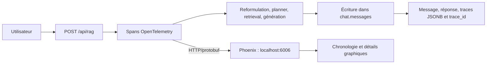

# Phoenix et OpenTelemetry dans RAG IONIS

## Leur rôle en une phrase

**OpenTelemetry produit et transporte les traces techniques du RAG ; Phoenix les stocke et fournit l’interface graphique pour les explorer.**

Dans ce projet, ils servent à comprendre ce qui se passe pendant un appel à `POST /api/rag` : plan choisi, recherches exécutées, sources récupérées, génération finale, durées et erreurs.

Ils n’exécutent pas le RAG et ne remplacent pas PostgreSQL.

Le pipeline batch de préparation des vidéos est documenté dans le README principal.

## Répartition des responsabilités

| Composant | Responsabilité dans le projet |
|---|---|
| OpenTelemetry | Créer une trace et des spans autour des étapes Python |
| OpenInference | Donner un vocabulaire adapté aux applications IA : `CHAIN`, `AGENT`, `RETRIEVER`, `RERANKER`, etc. |
| Instrumentation OpenAI | Tracer automatiquement les appels effectués avec le client OpenAI |
| Phoenix | Recevoir, conserver et afficher les traces dans une interface graphique |
| PostgreSQL `chat.messages` | Conserver durablement la conversation, la réponse et les données métier choisies par l’application |

Une **trace** correspond normalement à une requête RAG complète. Un **span** correspond à une opération à l’intérieur de cette requête.

## Flux dans le projet



Au démarrage de FastAPI, `configure_telemetry()` :

1. lit les variables `PHOENIX_*` ;
2. enregistre un fournisseur de traces OpenTelemetry ;
3. configure l’envoi vers Phoenix en HTTP/protobuf ;
4. active l’instrumentation automatique du client OpenAI ;
5. laisse l’API fonctionner même si Phoenix est indisponible.

Le code principal se trouve dans [`interface/backend/telemetry.py`](../interface/backend/telemetry.py).

## Ce qui est visible dans Phoenix

Les spans manuels actuels sont notamment :

| Span | Ce qu’il permet d’inspecter |
|---|---|
| `rag.request` | Requête complète, conversation, modèles demandés et réponse finale |
| `rag.orchestration` | Résultat global du routage et de la récupération |
| `rag.reformulation` | Question initiale, contexte conversationnel et question reformulée |
| `rag.planner` | Prompt du planner, sortie brute, validation Pydantic et plan retenu |
| `rag.speaker_resolution` | Noms demandés, correspondances et ambiguïtés |
| `rag.memory` | Lecture de l’historique de conversation |
| `rag.structured_sql` | Recherche structurée d’une vidéo ou de ses métadonnées |
| `rag.retrieval.prefilter` | Filtres SQL et identifiants candidats |
| `rag.retrieval.embedding` | Modèle d’embedding et nombre de dimensions |
| `rag.retrieval.bm25` | Requête lexicale, scores et chunks obtenus |
| `rag.retrieval.vector` | Recherche vectorielle et résultats |
| `rag.retrieval.rrf` | Fusion des classements BM25 et vectoriel |
| `rag.retrieval.rerank` | Entrées et résultats du reranking Cohere |
| `rag.source_evaluation` | Évaluation de la suffisance des sources |
| `rag.generation` | Sources envoyées au modèle et réponse générée |
| `rag.store_message` | Identifiants de conversation et de message écrits en SQL |

Pour chaque span, Phoenix peut afficher selon l’étape :

- les entrées et sorties JSON ;
- les attributs techniques ;
- la durée et l’ordre d’exécution ;
- les sous-spans OpenAI instrumentés automatiquement ;
- les erreurs levées pendant l’opération ;
- l’identifiant de session, qui correspond à `conversation_id` quand il est disponible.

## Relation avec la table `chat.messages`

Phoenix et `chat.messages` contiennent des informations qui se recouvrent, mais ils n’ont pas le même objectif.

| Besoin | Phoenix | `chat.messages` |
|---|---:|---:|
| Voir la chronologie imbriquée des étapes | Oui | Non, sauf reconstruction manuelle |
| Comparer les durées | Oui | Très limité |
| Inspecter rapidement prompts, résultats et erreurs | Oui | Oui pour les champs explicitement enregistrés |
| Relire la conversation dans l’application | Non | Oui |
| Garantir le stockage métier selon le schéma de l’application | Non | Oui |
| Faire des requêtes SQL ou des exports métier | Non | Oui |

Le champ `chat.messages.trace_id` contient l’identifiant hexadécimal de la trace Phoenix. Il permet de relier un message SQL à son exécution technique.

Pour l’instant, les colonnes détaillées comme `planner_prompt`, `bm25_trace`, `vector_trace` et `answer_response_raw` sont toujours conservées. Il est préférable de vérifier la parité sur des requêtes réelles avant de retirer certaines de ces colonnes. Même après cette vérification, les champs métier — question, réponse, sources citées, conversation et `trace_id` — doivent rester en SQL si l’application en dépend.

## Démarrage et accès

Le moyen habituel de tout démarrer est :

```powershell
.\start_app.bat
```

Pour démarrer seulement PostgreSQL et Phoenix :

```powershell
docker compose up -d postgres phoenix
```

Interfaces et contrôles :

- Phoenix : <http://127.0.0.1:6006/>
- état de la télémétrie : <http://127.0.0.1:8006/version>
- état de l’API : <http://127.0.0.1:8006/health>

Dans Phoenix, sélectionner le projet `rag-ionis`, puis ouvrir une trace `rag.request` pour développer ses sous-spans.

## Configuration

```dotenv
PHOENIX_ENABLED=true
PHOENIX_PORT=6006
PHOENIX_GRPC_PORT=4317
PHOENIX_COLLECTOR_ENDPOINT=http://localhost:6006/v1/traces
PHOENIX_PROJECT_NAME=rag-ionis
```

Le projet utilise actuellement l’endpoint HTTP `6006/v1/traces`. Le port gRPC `4317` est exposé par Docker mais n’est pas utilisé par `interface/backend/telemetry.py`.

Les données Phoenix persistent dans le volume Docker `rag_ionis_phoenix_data`.

Le backend, OpenTelemetry/Phoenix et le pipeline GPU utilisent tous le venv unique `.venv`.

## Lancer le RAG complet sur un dataset Phoenix

Le script [`run_phoenix_experiment.py`](run_phoenix_experiment.py) récupère un
dataset déjà présent dans Phoenix, exécute le pipeline RAG complet sur chaque
exemple et enregistre les sorties dans une expérience.

Lancé sans argument, il ouvre une fenêtre Tkinter qui demande :

- le dataset Phoenix, choisi dans une liste déroulante ;
- le nom de la nouvelle expérience.
- le LLM de reformulation ;
- le LLM du planner ;
- le LLM de réponse.
- les trois prompts système dans des zones de texte éditables.

Les trois sélecteurs sont indépendants et proposent :

1. `sol` (`gpt-5.6-sol`) ;
2. `terra` (`gpt-5.6-terra`) ;
3. `luna` (`gpt-5.6-luna`).

Le nom enregistré dans Phoenix reçoit automatiquement les trois noms de
modèles dans l'ordre reformulation, planner, réponse. Par exemple, le nom saisi
`rag-v1` devient `rag-v1_terra_luna_sol`.

Les prompts par défaut sont chargés dans trois onglets : `Reformulation`,
`Planner` et `Réponse`. Leur contenu peut être modifié avant le lancement.
Le prompt de réponse est un template commun aux routes RAG, SQL et mémoire. Il
accepte les marqueurs dynamiques suivants :

- `{route_instructions}` ;
- `{source_marker_instruction}` ;
- `{answer_action_instruction}` ;
- `{answer_style}`.

Un marqueur conservé dans la zone de texte est remplacé par les instructions
correspondant à chaque exemple au moment de l'appel LLM.

```powershell
.\.venv\Scripts\python.exe .\utils\run_phoenix_experiment.py
```

La fenêtre peut être évitée pour une exécution automatisée en fournissant
`--dataset`, `--experiment-name` et, si nécessaire, les trois modèles :

```powershell
.\.venv\Scripts\python.exe .\utils\run_phoenix_experiment.py `
  --dataset "nom-du-dataset" `
  --experiment-name "rag-modeles-mixtes" `
  --reformulation-model terra `
  --planner-model luna `
  --answer-model sol
```

Le champ d'entrée contenant la question doit s'appeler `question` par défaut.
Commencer par un seul exemple sans rien enregistrer :

```powershell
.\.venv\Scripts\python.exe .\utils\run_phoenix_experiment.py `
  --dataset "nom-du-dataset" `
  --dry-run
```

Puis lancer et enregistrer l'expérience sur tout le dataset :

```powershell
.\.venv\Scripts\python.exe .\utils\run_phoenix_experiment.py `
  --dataset "nom-du-dataset" `
  --experiment-name "rag-v1"
```

Si la question est imbriquée dans l'entrée du dataset, indiquer son chemin :

```powershell
.\.venv\Scripts\python.exe .\utils\run_phoenix_experiment.py `
  --dataset "nom-du-dataset" `
  --question-key "payload.question"
```

Le script appelle directement le code du backend : FastAPI n'a pas besoin
d'être démarré, mais PostgreSQL et Phoenix doivent être accessibles et les clés
`OPENAI_API_KEY` et `COHERE_API_KEY` doivent être configurées dans `.env`.
Comme le parcours est identique à une requête utilisateur, chaque exemple crée
aussi une conversation et un message dans PostgreSQL.

Deux évaluations déterministes sont enregistrées :

- `response_nonempty` vérifie qu'une réponse non vide a été produite ;
- `answer_action` classe la sortie en `answer`, `clarify` ou `abstain`.

Elles contrôlent le bon déroulement mais pas la justesse sémantique. Pour
mesurer la qualité des réponses, ajouter ensuite des réponses de référence ou
un évaluateur LLM.

## Lire une trace pour diagnostiquer une mauvaise réponse

Ordre conseillé :

1. ouvrir `rag.request` et vérifier la question et le modèle ;
2. lire `rag.reformulation` pour détecter une mauvaise reprise de contexte ;
3. lire `rag.planner` et son `execution_plan` ;
4. contrôler le préfiltre et les résultats BM25/vectoriels ;
5. vérifier l’ordre après RRF et Cohere ;
6. ouvrir `rag.source_evaluation` ;
7. comparer les chunks disponibles avec ceux réellement cités dans `rag.generation` ;
8. utiliser le `trace_id` pour retrouver le message correspondant en SQL.

Cette lecture permet de distinguer une erreur de planification, de retrieval, de ranking ou de génération.

## Ajouter une nouvelle opération tracée

```python
from interface.backend.telemetry import trace_operation

with trace_operation(
    "rag.ma_nouvelle_etape",
    kind="CHAIN",
    input_value={"question": question},
) as span:
    result = ma_nouvelle_etape(question)
    span.set_attribute("rag.result_count", len(result))
    span.set_output(result)
```

Le contexte OpenTelemetry rattache automatiquement ce span au span parent actif.

## Limites et précautions

- Phoenix n’est pas la base métier de l’application.
- Les traces peuvent contenir questions, prompts, chunks et réponses : l’interface est donc liée uniquement à `127.0.0.1`.
- Une sortie JSON très volumineuse rend l’interface plus lente ; mieux vaut tracer des aperçus ou des compteurs quand le volume augmente.
- Si Phoenix tombe, le RAG continue normalement : l’observabilité a été conçue comme non bloquante.
- Désactiver l’envoi avec `PHOENIX_ENABLED=false` si aucune trace ne doit être produite.

## Dépannage rapide

```powershell
docker compose ps phoenix
docker compose logs --tail 100 phoenix
Invoke-RestMethod http://127.0.0.1:8006/version
```

Dans `/version` :

- `configured: true` signifie que l’initialisation a été tentée ;
- `enabled: true` signifie que le tracer est actif ;
- `initialization_error` explique pourquoi l’initialisation a échoué, le cas échéant.
