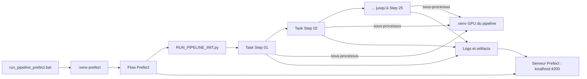

# Prefect dans RAG IONIS

## Son rôle en une phrase

**Prefect orchestre et rend observable le pipeline batch qui transforme les vidéos en données utilisables par le RAG.**

Il lance les scripts existants, suit leur état, centralise leurs logs, applique les nouvelles tentatives configurées et publie des aperçus des sorties dans une interface graphique.

Prefect ne remplace pas les scripts OCR, WhisperX, chunking ou embeddings. Il ne remplace pas non plus les fichiers locaux, S3 ou PostgreSQL.

Pour l’observation des requêtes interactives du RAG, voir [PHOENIX_OPENTELEMETRY.md](PHOENIX_OPENTELEMETRY.md).

## Les deux pipelines à ne pas confondre

| Partie du projet | Outil d’observation | Déclenchement |
|---|---|---|
| Préparation des vidéos : téléchargement, images, OCR, transcription, chunks, embeddings | Prefect | `run_pipeline_prefect.bat` |
| Réponse interactive à `POST /api/rag` | Phoenix/OpenTelemetry | Une question envoyée à l’API |

Prefect répond donc à la question : **« où en est la préparation de mes vidéos ? »**

Phoenix répond plutôt à : **« pourquoi le RAG a-t-il produit cette réponse ? »**

## Architecture réelle dans le projet



Deux environnements Python sont volontairement utilisés :

- `.venv-prefect` exécute le flow et communique avec le serveur Prefect ;
- `.venv` reste l’environnement GPU/métier qui exécute les scripts historiques.

La variable `PIPELINE_PYTHON` indique à l’orchestrateur quel Python utiliser pour les sous-processus du pipeline.

## Comment le runner fonctionne

Le fichier [`scripts/init/RUN_PIPELINE_PREFECT.py`](../scripts/init/RUN_PIPELINE_PREFECT.py) importe le runner historique `RUN_PIPELINE_INIT.py`.

Au début du flow, il remplace temporairement sa fonction `run_step` par `prefect_run_step`. La sélection des vidéos, l’ordre des étapes et les arguments restent donc ceux du runner existant.

Pour chaque étape :

1. Prefect crée une task portant le nom de la vidéo et de l’étape ;
2. la task démarre le script historique comme sous-processus avec `.venv` ;
3. `stdout` et `stderr` sont envoyés progressivement dans les logs Prefect ;
4. un code de retour non nul fait échouer la task ;
5. Prefect applique éventuellement un retry ;
6. après le succès, le projet inspecte les sorties produites et publie des artifacts.

Les étapes restent **séquentielles**. L’intégration actuelle n’ajoute pas de parallélisation.

## Ce que montre l’interface graphique

Interface : <http://127.0.0.1:4200/>

Un lancement crée un **flow run**. À l’intérieur, chaque commande du pipeline devient un **task run**.

L’interface permet de voir :

- l’état du flow : en cours, terminé ou échoué ;
- l’état de chaque task ;
- l’ordre d’exécution ;
- la durée de chaque étape ;
- les logs diffusés pendant l’exécution du sous-processus ;
- les nouvelles tentatives ;
- l’exception et le code de retour en cas d’échec ;
- les artifacts Markdown et les indicateurs de progression.

## Peut-on voir les informations extraites peu à peu ?

Oui, à deux niveaux :

- **pendant une étape**, les logs sont visibles au fur et à mesure ;
- **après chaque étape réussie**, un nouvel artifact résume l’état courant des fichiers de la vidéo.

Un artifact peut contenir selon les sorties déjà disponibles :

- titre, durée et type de vidéo ;
- détection de sous-titres ;
- nombre d’images et répartition par catégorie ;
- classes prédites pour les frames ;
- fichiers OCR, volumes et aperçus de textes ;
- fichiers de transcription et aperçu du résumé ;
- nombre de chunks ;
- locuteurs détectés ;
- aperçu des premiers chunks ;
- nombre de fichiers d’embeddings ;
- commande exécutée et durée de l’étape.

La progression est calculée à partir de `Step N / 25`.

Important : l’artifact est un **instantané publié à la fin d’une étape**, pas un affichage en temps réel de chaque élément OCR ou de chaque chunk produit à l’intérieur de cette étape.

Le générateur d’artifacts est dans [`scripts/init/common/prefect_artifacts.py`](../scripts/init/common/prefect_artifacts.py).

## Où sont réellement stockées les données ?

| Donnée | Emplacement principal |
|---|---|
| Vidéos, images, OCR, transcripts, chunks et embeddings complets | Dossiers locaux du pipeline et éventuellement S3 |
| Métadonnées finales utilisées par le RAG | PostgreSQL et stockage prévu par les scripts |
| États, durées, logs et historique des runs | Serveur Prefect |
| Aperçus lisibles des sorties | Artifacts Prefect |

Les artifacts sont volontairement limités :

- les JSON de plus de 20 Mo ne sont pas chargés pour construire l’aperçu ;
- les extraits de texte sont raccourcis ;
- les vecteurs d’embedding complets ne sont pas copiés dans Prefect ;
- le nombre d’embeddings est affiché, pas leur contenu.

Prefect est donc un tableau de bord d’orchestration, pas un stockage de remplacement pour les résultats du pipeline.

## Démarrage

Créer l’environnement si nécessaire :

```powershell
py -3.10 -m venv .venv-prefect
.\.venv-prefect\Scripts\python.exe -m pip install --upgrade pip
.\.venv-prefect\Scripts\python.exe -m pip install -r requirements-prefect.txt
```

Le lanceur démarre automatiquement PostgreSQL et Prefect :

```powershell
.\run_pipeline_prefect.bat smoke
```

Le mode `smoke` ne lance pas la préparation des vidéos. Il vérifie la connexion au serveur, l’exécution locale d’une task et la publication d’un artifact.

Exemples de lancements réels :

```powershell
.\run_pipeline_prefect.bat 3 --openai-mode normal --review-scope duo
.\run_pipeline_prefect.bat all --openai-mode batch --review-scope all
```

Les arguments sont transmis au runner historique.

## Règles de retry actuelles

| Type d’étape détecté dans son libellé | Retries |
|---|---:|
| Réseau, téléchargement, OpenAI, upload ou mise à jour SQL | 2 |
| OCR, Whisper, embeddings ou classification | 1 |
| Autres étapes | 0 |

Le délai entre deux tentatives est de 30 secondes. Une task peut durer au maximum 6 heures.

Un retry relance la commande complète de l’étape. Les scripts doivent donc rester capables de reprendre ou de réécrire proprement leurs sorties.

## Configuration et persistance

```dotenv
PREFECT_UI_PORT=4200
PREFECT_API_URL=http://127.0.0.1:4200/api
PIPELINE_PYTHON=.\.venv\Scripts\python.exe
```

Le serveur est lancé dans Docker avec l’image `prefecthq/prefect:3.7.7-python3.12`.

Ses données persistent dans le volume Docker `rag_ionis_prefect_data`. Redémarrer ou recréer le conteneur ne supprime donc pas normalement l’historique tant que ce volume est conservé.

Le port est lié à `127.0.0.1`, donc l’interface n’est pas exposée directement sur le réseau.

## Sécurité des variables

Le runner ne transmet explicitement à la task Prefect que les ajustements d’environnement considérés comme sûrs :

- `PIPELINE_OPENAI_MODE` ;
- `PYTHONUTF8`.

Les secrets ne sont pas ajoutés aux paramètres de task ni aux artifacts. Le sous-processus hérite néanmoins de l’environnement local nécessaire à son exécution ; il faut donc éviter que les scripts impriment des secrets dans leurs logs.

## Ce que Prefect ne fait pas encore ici

- pas de parallélisation des vidéos ou des étapes ;
- pas de cache Prefect pour éviter une étape déjà calculée ;
- pas de deployment ni de worker distant ;
- pas de planification horaire ;
- pas de reprise automatique d’un flow après extinction du processus lanceur ;
- pas de remplacement des règles de nettoyage du pipeline historique.

En particulier, un lancement complet conserve le comportement destructif de `RUN_PIPELINE_INIT.py` : s’il nettoie les anciennes sorties ou réinitialise des données, Prefect ne l’empêche pas.

## Diagnostiquer un échec

1. ouvrir le dernier flow run dans <http://127.0.0.1:4200/> ;
2. repérer la première task rouge ;
3. lire ses derniers logs et sa commande ;
4. vérifier si un retry a déjà eu lieu ;
5. contrôler les fichiers produits dans le dossier de la vidéo ;
6. corriger la cause dans le script métier ;
7. relancer avec les mêmes arguments.

Contrôles Docker utiles :

```powershell
docker compose ps prefect
docker compose logs --tail 100 prefect
Invoke-WebRequest http://127.0.0.1:4200/api/health
```

Si le serveur est disponible mais qu’aucun run n’apparaît, vérifier :

```powershell
$env:PREFECT_API_URL
$env:PIPELINE_PYTHON
Test-Path .\.venv-prefect\Scripts\python.exe
Test-Path .\.venv\Scripts\python.exe
```

## Résumé mental

```text
Prefect = exécuter, suivre et relancer le pipeline batch
Artifacts = aperçus progressifs après chaque étape
Fichiers/S3/PostgreSQL = données complètes et métier
Phoenix = comprendre une requête interactive du RAG
```
